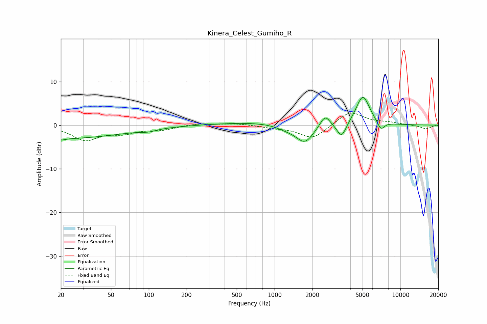

# Kinera_Celest_Gumiho_R
See [usage instructions](https://github.com/jaakkopasanen/AutoEq#usage) for more options and info.

### Parametric EQs
Apply preamp of -6.5 dB when using parametric equalizer.

|   # | Type    |   Fc (Hz) |    Q |   Gain (dB) |
|-----|---------|-----------|------|-------------|
|   1 | Peaking |        20 | 0.28 |        -3.1 |
|   2 | Peaking |        20 | 4.87 |        -0.3 |
|   3 | Peaking |        99 | 2.21 |        -0.5 |
|   4 | Peaking |       767 | 0.44 |         0.7 |
|   5 | Peaking |      1250 | 1.67 |        -0.9 |
|   6 | Peaking |      1739 | 2.05 |        -4.1 |
|   7 | Peaking |      2518 | 3.56 |         2.8 |
|   8 | Peaking |      3409 | 3.73 |        -3.5 |
|   9 | Peaking |      5027 | 2.52 |         6.8 |
|  10 | Peaking |      6988 | 4.63 |        -2.1 |

### Fixed Band EQs
When using fixed band (also called graphic) equalizer, apply preamp of **-2.9 dB** (if available) and set gains manually with these parameters.

|   # | Type    |   Fc (Hz) |    Q |   Gain (dB) |
|-----|---------|-----------|------|-------------|
|   1 | Peaking |        31 | 1.41 |        -3.3 |
|   2 | Peaking |        62 | 1.41 |        -1.5 |
|   3 | Peaking |       125 | 1.41 |        -0.9 |
|   4 | Peaking |       250 | 1.41 |         0.4 |
|   5 | Peaking |       500 | 1.41 |         0.4 |
|   6 | Peaking |      1000 | 1.41 |        -0.5 |
|   7 | Peaking |      2000 | 1.41 |        -3.2 |
|   8 | Peaking |      4000 | 1.41 |         3.2 |
|   9 | Peaking |      8000 | 1.41 |         0.5 |
|  10 | Peaking |     16000 | 1.41 |        -0.9 |

### Graphs

