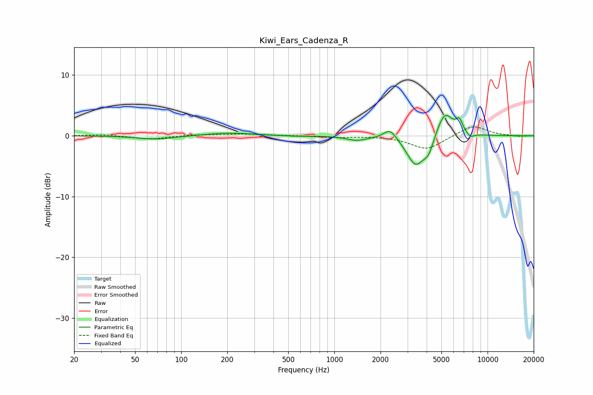

# Kiwi_Ears_Cadenza_R
See [usage instructions](https://github.com/jaakkopasanen/AutoEq#usage) for more options and info.

### Parametric EQs
Apply preamp of -3.4 dB when using parametric equalizer.

|   # | Type    |   Fc (Hz) |    Q |   Gain (dB) |
|-----|---------|-----------|------|-------------|
|   1 | Peaking |        69 | 1.18 |        -0.6 |
|   2 | Peaking |       206 | 0.95 |         0.5 |
|   3 | Peaking |       545 | 2.03 |        -0.1 |
|   4 | Peaking |      1398 | 2.16 |        -0.7 |
|   5 | Peaking |      2309 | 3.53 |         1.7 |
|   6 | Peaking |      3391 | 2.44 |        -4.9 |
|   7 | Peaking |      4122 | 4.25 |        -2.2 |
|   8 | Peaking |      5253 | 2.64 |         4.2 |
|   9 | Peaking |      6537 | 5.99 |         1.9 |
|  10 | Peaking |      7711 | 5.29 |        -0.7 |

### Fixed Band EQs
When using fixed band (also called graphic) equalizer, apply preamp of **-1.5 dB** (if available) and set gains manually with these parameters.

|   # | Type    |   Fc (Hz) |    Q |   Gain (dB) |
|-----|---------|-----------|------|-------------|
|   1 | Peaking |        31 | 1.41 |         0.2 |
|   2 | Peaking |        62 | 1.41 |        -0.6 |
|   3 | Peaking |       125 | 1.41 |         0.2 |
|   4 | Peaking |       250 | 1.41 |         0.3 |
|   5 | Peaking |       500 | 1.41 |         0   |
|   6 | Peaking |      1000 | 1.41 |        -0.3 |
|   7 | Peaking |      2000 | 1.41 |        -0   |
|   8 | Peaking |      4000 | 1.41 |        -2.3 |
|   9 | Peaking |      8000 | 1.41 |         1.8 |
|  10 | Peaking |     16000 | 1.41 |        -0.1 |

### Graphs

