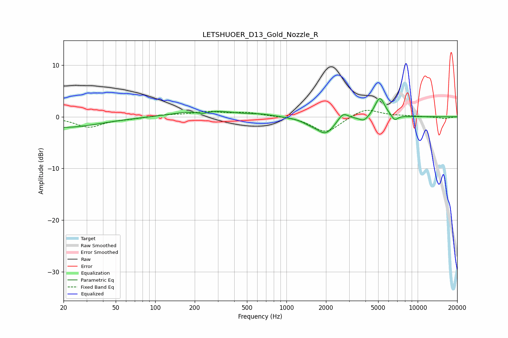

# LETSHUOER_D13_Gold_Nozzle_R
See [usage instructions](https://github.com/jaakkopasanen/AutoEq#usage) for more options and info.

### Parametric EQs
Apply preamp of -3.6 dB when using parametric equalizer.

|   # | Type    |   Fc (Hz) |    Q |   Gain (dB) |
|-----|---------|-----------|------|-------------|
|   1 | Peaking |        20 | 0.51 |        -2.1 |
|   2 | Peaking |       229 | 2.69 |        -0.7 |
|   3 | Peaking |       238 | 0.77 |         1.5 |
|   4 | Peaking |       644 | 1.78 |         0.3 |
|   5 | Peaking |      1511 | 2.34 |        -0.7 |
|   6 | Peaking |      1991 | 2.09 |        -3.1 |
|   7 | Peaking |      2695 | 3.76 |         1.5 |
|   8 | Peaking |      3900 | 3.82 |        -1.1 |
|   9 | Peaking |      5145 | 3.6  |         3.9 |
|  10 | Peaking |      6676 | 5.42 |        -1.1 |

### Fixed Band EQs
When using fixed band (also called graphic) equalizer, apply preamp of **-1.3 dB** (if available) and set gains manually with these parameters.

|   # | Type    |   Fc (Hz) |    Q |   Gain (dB) |
|-----|---------|-----------|------|-------------|
|   1 | Peaking |        31 | 1.41 |        -2   |
|   2 | Peaking |        62 | 1.41 |        -0.3 |
|   3 | Peaking |       125 | 1.41 |         0.4 |
|   4 | Peaking |       250 | 1.41 |         0.9 |
|   5 | Peaking |       500 | 1.41 |         0.7 |
|   6 | Peaking |      1000 | 1.41 |         0.1 |
|   7 | Peaking |      2000 | 1.41 |        -3.1 |
|   8 | Peaking |      4000 | 1.41 |         1.7 |
|   9 | Peaking |      8000 | 1.41 |         0.1 |
|  10 | Peaking |     16000 | 1.41 |        -0.3 |

### Graphs

