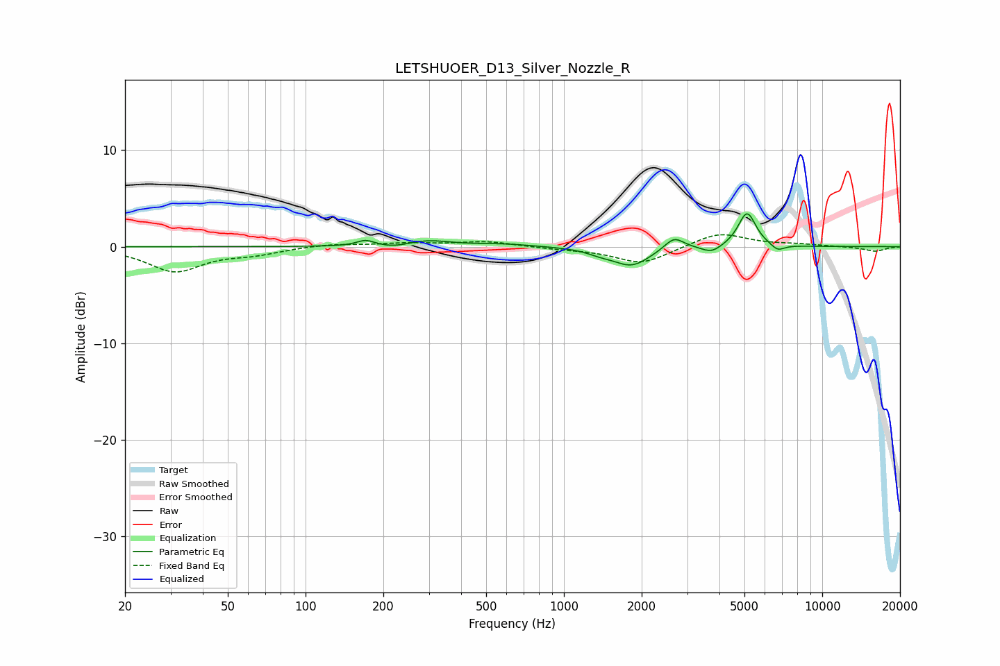

# LETSHUOER_D13_Silver_Nozzle_R
See [usage instructions](https://github.com/jaakkopasanen/AutoEq#usage) for more options and info.

### Parametric EQs
Apply preamp of -3.5 dB when using parametric equalizer.

|   # | Type    |   Fc (Hz) |    Q |   Gain (dB) |
|-----|---------|-----------|------|-------------|
|   1 | Peaking |       171 | 4.07 |         0.6 |
|   2 | Peaking |       220 | 2.53 |        -0.3 |
|   3 | Peaking |       297 | 1.7  |         0.6 |
|   4 | Peaking |       573 | 1.21 |         0.3 |
|   5 | Peaking |      1378 | 2.83 |        -0.4 |
|   6 | Peaking |      1827 | 1.96 |        -1.9 |
|   7 | Peaking |      2669 | 3.81 |         1.3 |
|   8 | Peaking |      3731 | 3.75 |        -0.8 |
|   9 | Peaking |      5115 | 4.06 |         3.6 |
|  10 | Peaking |      6725 | 5.21 |        -0.7 |

### Fixed Band EQs
When using fixed band (also called graphic) equalizer, apply preamp of **-1.3 dB** (if available) and set gains manually with these parameters.

|   # | Type    |   Fc (Hz) |    Q |   Gain (dB) |
|-----|---------|-----------|------|-------------|
|   1 | Peaking |        31 | 1.41 |        -2.5 |
|   2 | Peaking |        62 | 1.41 |        -0.6 |
|   3 | Peaking |       125 | 1.41 |         0.3 |
|   4 | Peaking |       250 | 1.41 |         0.3 |
|   5 | Peaking |       500 | 1.41 |         0.5 |
|   6 | Peaking |      1000 | 1.41 |        -0.2 |
|   7 | Peaking |      2000 | 1.41 |        -1.8 |
|   8 | Peaking |      4000 | 1.41 |         1.5 |
|   9 | Peaking |      8000 | 1.41 |         0.2 |
|  10 | Peaking |     16000 | 1.41 |        -0.5 |

### Graphs

