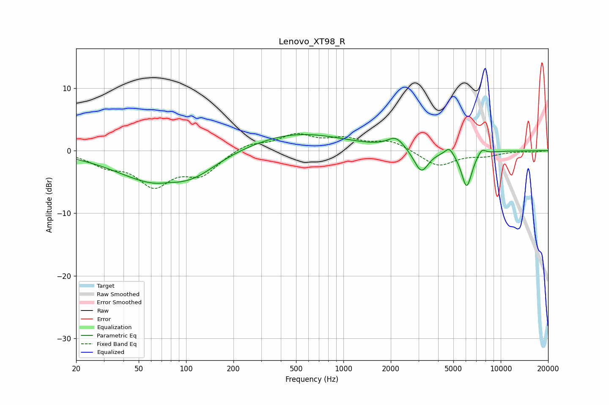

# Lenovo_XT98_R
See [usage instructions](https://github.com/jaakkopasanen/AutoEq#usage) for more options and info.

### Parametric EQs
Apply preamp of -2.7 dB when using parametric equalizer.

|   # | Type    |   Fc (Hz) |    Q |   Gain (dB) |
|-----|---------|-----------|------|-------------|
|   1 | Peaking |        41 | 4.07 |         0   |
|   2 | Peaking |        67 | 0.55 |        -5.1 |
|   3 | Peaking |        77 | 2.93 |         0.2 |
|   4 | Peaking |       116 | 1.11 |        -1.3 |
|   5 | Peaking |       502 | 0.46 |         2.9 |
|   6 | Peaking |      2158 | 2.63 |         1.9 |
|   7 | Peaking |      3126 | 3.07 |        -3.7 |
|   8 | Peaking |      4710 | 5.2  |         1.3 |
|   9 | Peaking |      6074 | 4.08 |        -5.8 |
|  10 | Peaking |      7571 | 5.26 |         1   |

### Fixed Band EQs
When using fixed band (also called graphic) equalizer, apply preamp of **-2.8 dB** (if available) and set gains manually with these parameters.

|   # | Type    |   Fc (Hz) |    Q |   Gain (dB) |
|-----|---------|-----------|------|-------------|
|   1 | Peaking |        31 | 1.41 |        -2   |
|   2 | Peaking |        62 | 1.41 |        -5.1 |
|   3 | Peaking |       125 | 1.41 |        -3.5 |
|   4 | Peaking |       250 | 1.41 |         1.2 |
|   5 | Peaking |       500 | 1.41 |         2.4 |
|   6 | Peaking |      1000 | 1.41 |         1.6 |
|   7 | Peaking |      2000 | 1.41 |         1.5 |
|   8 | Peaking |      4000 | 1.41 |        -2.5 |
|   9 | Peaking |      8000 | 1.41 |        -0.7 |
|  10 | Peaking |     16000 | 1.41 |        -0.2 |

### Graphs

