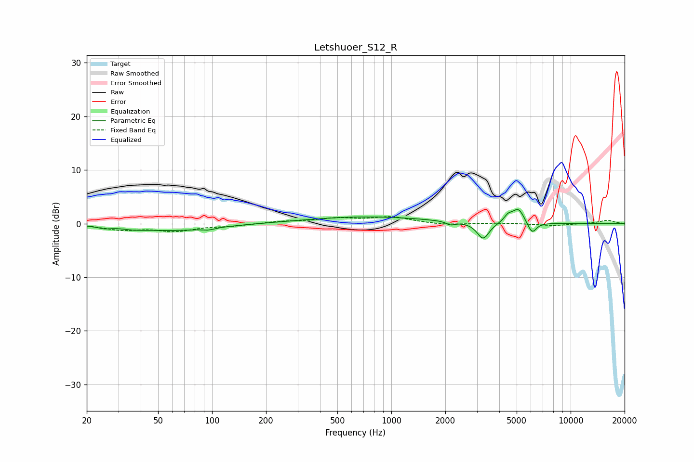

# Letshuoer_S12_R
See [usage instructions](https://github.com/jaakkopasanen/AutoEq#usage) for more options and info.

### Parametric EQs
Apply preamp of -2.7 dB when using parametric equalizer.

|   # | Type    |   Fc (Hz) |    Q |   Gain (dB) |
|-----|---------|-----------|------|-------------|
|   1 | Peaking |        25 | 4.41 |        -0.4 |
|   2 | Peaking |        36 | 2.99 |        -0.2 |
|   3 | Peaking |        58 | 0.58 |        -1.3 |
|   4 | Peaking |        95 | 4.16 |        -0.4 |
|   5 | Peaking |       724 | 0.43 |         1.3 |
|   6 | Peaking |      2141 | 5.79 |        -0.6 |
|   7 | Peaking |      3252 | 4.22 |        -3.1 |
|   8 | Peaking |      4481 | 5.99 |         1.2 |
|   9 | Peaking |      5112 | 4.21 |         2.7 |
|  10 | Peaking |      6090 | 5.57 |        -2.2 |

### Fixed Band EQs
When using fixed band (also called graphic) equalizer, apply preamp of **-1.4 dB** (if available) and set gains manually with these parameters.

|   # | Type    |   Fc (Hz) |    Q |   Gain (dB) |
|-----|---------|-----------|------|-------------|
|   1 | Peaking |        31 | 1.41 |        -1.1 |
|   2 | Peaking |        62 | 1.41 |        -1.3 |
|   3 | Peaking |       125 | 1.41 |        -0.4 |
|   4 | Peaking |       250 | 1.41 |         0.4 |
|   5 | Peaking |       500 | 1.41 |         0.9 |
|   6 | Peaking |      1000 | 1.41 |         1.2 |
|   7 | Peaking |      2000 | 1.41 |        -0.3 |
|   8 | Peaking |      4000 | 1.41 |         0.1 |
|   9 | Peaking |      8000 | 1.41 |        -0.4 |
|  10 | Peaking |     16000 | 1.41 |         0.6 |

### Graphs

