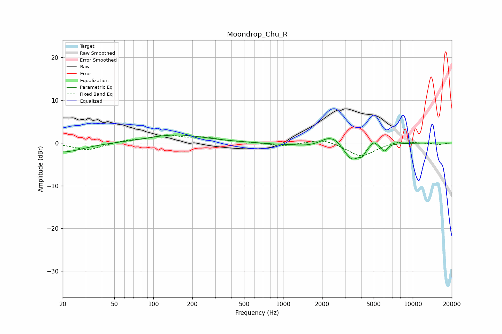

# Moondrop_Chu_R
See [usage instructions](https://github.com/jaakkopasanen/AutoEq#usage) for more options and info.

### Parametric EQs
Apply preamp of -2.0 dB when using parametric equalizer.

|   # | Type    |   Fc (Hz) |    Q |   Gain (dB) |
|-----|---------|-----------|------|-------------|
|   1 | Peaking |        20 | 0.93 |        -2.2 |
|   2 | Peaking |       150 | 0.64 |         1.9 |
|   3 | Peaking |       839 | 1.6  |        -0.2 |
|   4 | Peaking |      1513 | 1.32 |        -0.6 |
|   5 | Peaking |      2204 | 2.46 |         1.4 |
|   6 | Peaking |      2547 | 3.27 |         1   |
|   7 | Peaking |      3402 | 2.46 |        -3.9 |
|   8 | Peaking |      4081 | 5.85 |        -1.4 |
|   9 | Peaking |      4997 | 5.99 |         1.1 |
|  10 | Peaking |      6033 | 6    |        -1.7 |

### Fixed Band EQs
When using fixed band (also called graphic) equalizer, apply preamp of **-2.0 dB** (if available) and set gains manually with these parameters.

|   # | Type    |   Fc (Hz) |    Q |   Gain (dB) |
|-----|---------|-----------|------|-------------|
|   1 | Peaking |        31 | 1.41 |        -1.7 |
|   2 | Peaking |        62 | 1.41 |         0.6 |
|   3 | Peaking |       125 | 1.41 |         1.7 |
|   4 | Peaking |       250 | 1.41 |         1.1 |
|   5 | Peaking |       500 | 1.41 |         0.2 |
|   6 | Peaking |      1000 | 1.41 |        -0.7 |
|   7 | Peaking |      2000 | 1.41 |         1.1 |
|   8 | Peaking |      4000 | 1.41 |        -3.2 |
|   9 | Peaking |      8000 | 1.41 |         0.6 |
|  10 | Peaking |     16000 | 1.41 |        -0.4 |

### Graphs

