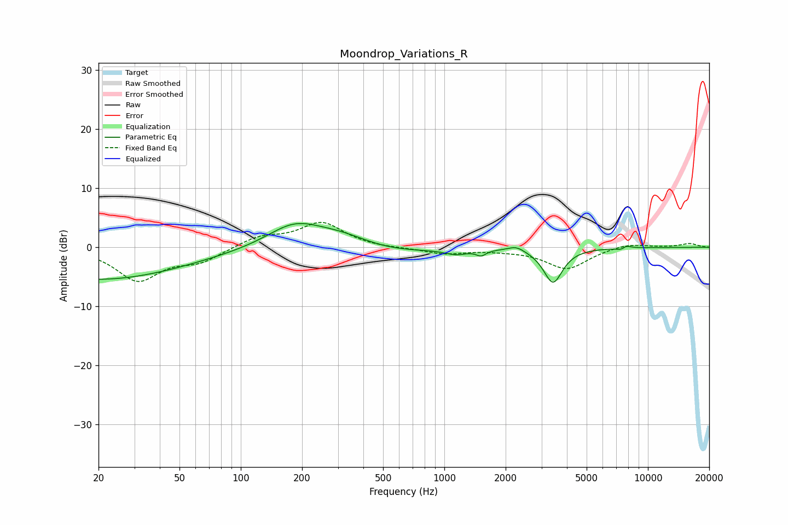

# Moondrop_Variations_R
See [usage instructions](https://github.com/jaakkopasanen/AutoEq#usage) for more options and info.

### Parametric EQs
Apply preamp of -4.1 dB when using parametric equalizer.

|   # | Type    |   Fc (Hz) |    Q |   Gain (dB) |
|-----|---------|-----------|------|-------------|
|   1 | Peaking |        20 | 0.33 |        -5.5 |
|   2 | Peaking |       183 | 1.03 |         4.1 |
|   3 | Peaking |       317 | 0.9  |         2.7 |
|   4 | Peaking |       417 | 0.54 |        -1.8 |
|   5 | Peaking |      1142 | 2.7  |        -0.8 |
|   6 | Peaking |      1515 | 5.94 |        -0.9 |
|   7 | Peaking |      2255 | 3.71 |         0.8 |
|   8 | Peaking |      3419 | 3.05 |        -5.9 |
|   9 | Peaking |      7493 | 5.58 |        -1   |
|  10 | Peaking |      7674 | 5.32 |         1.1 |

### Fixed Band EQs
When using fixed band (also called graphic) equalizer, apply preamp of **-4.3 dB** (if available) and set gains manually with these parameters.

|   # | Type    |   Fc (Hz) |    Q |   Gain (dB) |
|-----|---------|-----------|------|-------------|
|   1 | Peaking |        31 | 1.41 |        -5.5 |
|   2 | Peaking |        62 | 1.41 |        -2.2 |
|   3 | Peaking |       125 | 1.41 |         1.8 |
|   4 | Peaking |       250 | 1.41 |         4.1 |
|   5 | Peaking |       500 | 1.41 |        -0.2 |
|   6 | Peaking |      1000 | 1.41 |        -1.1 |
|   7 | Peaking |      2000 | 1.41 |        -0.3 |
|   8 | Peaking |      4000 | 1.41 |        -3.6 |
|   9 | Peaking |      8000 | 1.41 |         0.8 |
|  10 | Peaking |     16000 | 1.41 |         0.6 |

### Graphs

