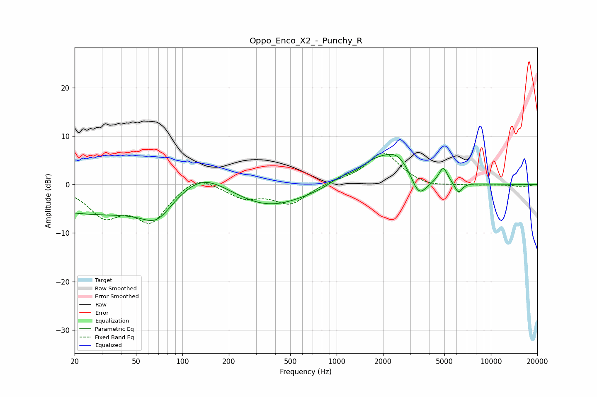

# Oppo_Enco_X2_-_Punchy_R
See [usage instructions](https://github.com/jaakkopasanen/AutoEq#usage) for more options and info.

### Parametric EQs
Apply preamp of -6.3 dB when using parametric equalizer.

|   # | Type    |   Fc (Hz) |    Q |   Gain (dB) |
|-----|---------|-----------|------|-------------|
|   1 | Peaking |        32 | 0.23 |        -6.2 |
|   2 | Peaking |        68 | 1.52 |        -4   |
|   3 | Peaking |       132 | 0.8  |         6   |
|   4 | Peaking |       363 | 0.59 |        -4.6 |
|   5 | Peaking |      1049 | 2.06 |         1.3 |
|   6 | Peaking |      1701 | 1.47 |         2.8 |
|   7 | Peaking |      2470 | 1.3  |         6.1 |
|   8 | Peaking |      3408 | 2.58 |        -5.1 |
|   9 | Peaking |      4909 | 4.99 |         3.2 |
|  10 | Peaking |      6160 | 5.48 |        -2.2 |

### Fixed Band EQs
When using fixed band (also called graphic) equalizer, apply preamp of **-6.6 dB** (if available) and set gains manually with these parameters.

|   # | Type    |   Fc (Hz) |    Q |   Gain (dB) |
|-----|---------|-----------|------|-------------|
|   1 | Peaking |        31 | 1.41 |        -5.9 |
|   2 | Peaking |        62 | 1.41 |        -7.2 |
|   3 | Peaking |       125 | 1.41 |         2.5 |
|   4 | Peaking |       250 | 1.41 |        -2.5 |
|   5 | Peaking |       500 | 1.41 |        -3.9 |
|   6 | Peaking |      1000 | 1.41 |         0.6 |
|   7 | Peaking |      2000 | 1.41 |         6.7 |
|   8 | Peaking |      4000 | 1.41 |        -0.7 |
|   9 | Peaking |      8000 | 1.41 |        -0.2 |
|  10 | Peaking |     16000 | 1.41 |        -0.5 |

### Graphs

