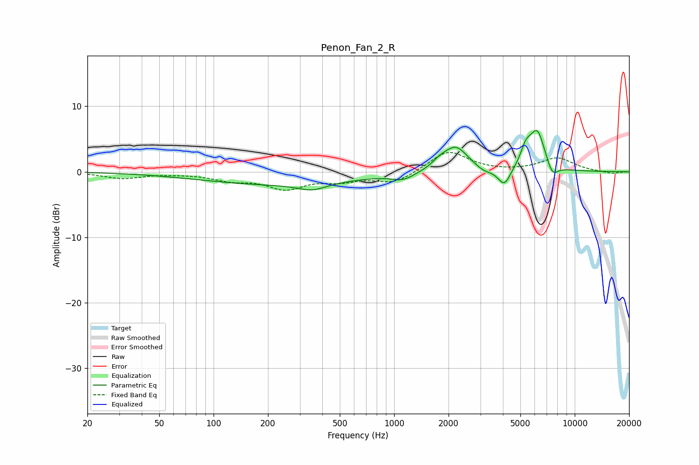

# Penon_Fan_2_R
See [usage instructions](https://github.com/jaakkopasanen/AutoEq#usage) for more options and info.

### Parametric EQs
Apply preamp of -6.4 dB when using parametric equalizer.

|   # | Type    |   Fc (Hz) |    Q |   Gain (dB) |
|-----|---------|-----------|------|-------------|
|   1 | Peaking |       219 | 0.33 |        -1.9 |
|   2 | Peaking |       352 | 1.81 |        -1.1 |
|   3 | Peaking |      1122 | 2.26 |        -1   |
|   4 | Peaking |      1777 | 3.7  |         0.7 |
|   5 | Peaking |      2187 | 2.03 |         3.9 |
|   6 | Peaking |      3137 | 3.16 |        -0.7 |
|   7 | Peaking |      4075 | 3.97 |        -2.7 |
|   8 | Peaking |      5363 | 4.78 |         2.4 |
|   9 | Peaking |      6201 | 3.16 |         6   |
|  10 | Peaking |      7516 | 4.34 |        -2   |

### Fixed Band EQs
When using fixed band (also called graphic) equalizer, apply preamp of **-3.0 dB** (if available) and set gains manually with these parameters.

|   # | Type    |   Fc (Hz) |    Q |   Gain (dB) |
|-----|---------|-----------|------|-------------|
|   1 | Peaking |        31 | 1.41 |        -1   |
|   2 | Peaking |        62 | 1.41 |        -0.1 |
|   3 | Peaking |       125 | 1.41 |        -1.1 |
|   4 | Peaking |       250 | 1.41 |        -2.4 |
|   5 | Peaking |       500 | 1.41 |        -1.1 |
|   6 | Peaking |      1000 | 1.41 |        -1.7 |
|   7 | Peaking |      2000 | 1.41 |         3.2 |
|   8 | Peaking |      4000 | 1.41 |        -0   |
|   9 | Peaking |      8000 | 1.41 |         2.1 |
|  10 | Peaking |     16000 | 1.41 |        -0.3 |

### Graphs

