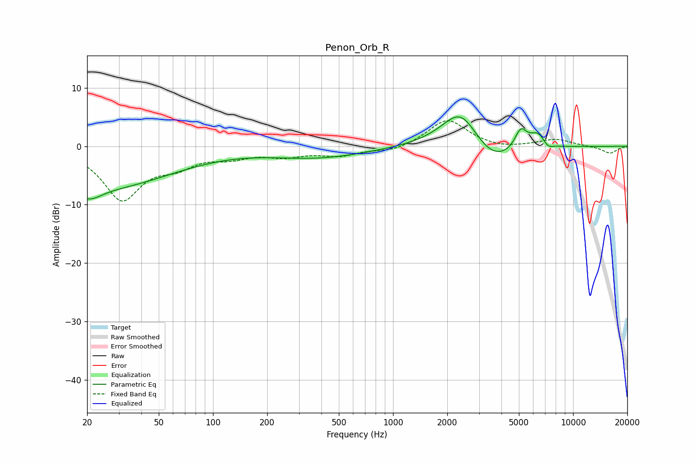

# Penon_Orb_R
See [usage instructions](https://github.com/jaakkopasanen/AutoEq#usage) for more options and info.

### Parametric EQs
Apply preamp of -5.1 dB when using parametric equalizer.

|   # | Type    |   Fc (Hz) |    Q |   Gain (dB) |
|-----|---------|-----------|------|-------------|
|   1 | Peaking |        20 | 1.83 |        -3.1 |
|   2 | Peaking |        28 | 0.4  |        -6.4 |
|   3 | Peaking |       385 | 0.53 |        -1.9 |
|   4 | Peaking |      2392 | 1.27 |         7.8 |
|   5 | Peaking |      3468 | 1.03 |        -4.7 |
|   6 | Peaking |      5123 | 4.11 |         3.4 |
|   7 | Peaking |      6393 | 2.94 |         1.7 |
|   8 | Peaking |      6459 | 2.6  |         1.3 |
|   9 | Peaking |      7278 | 3.51 |        -1.9 |
|  10 | Peaking |      7592 | 3.96 |         0.6 |

### Fixed Band EQs
When using fixed band (also called graphic) equalizer, apply preamp of **-4.5 dB** (if available) and set gains manually with these parameters.

|   # | Type    |   Fc (Hz) |    Q |   Gain (dB) |
|-----|---------|-----------|------|-------------|
|   1 | Peaking |        31 | 1.41 |        -8.9 |
|   2 | Peaking |        62 | 1.41 |        -2.6 |
|   3 | Peaking |       125 | 1.41 |        -1.5 |
|   4 | Peaking |       250 | 1.41 |        -1.4 |
|   5 | Peaking |       500 | 1.41 |        -1.4 |
|   6 | Peaking |      1000 | 1.41 |        -0.9 |
|   7 | Peaking |      2000 | 1.41 |         4.7 |
|   8 | Peaking |      4000 | 1.41 |        -0.5 |
|   9 | Peaking |      8000 | 1.41 |         1.2 |
|  10 | Peaking |     16000 | 1.41 |        -1.2 |

### Graphs

