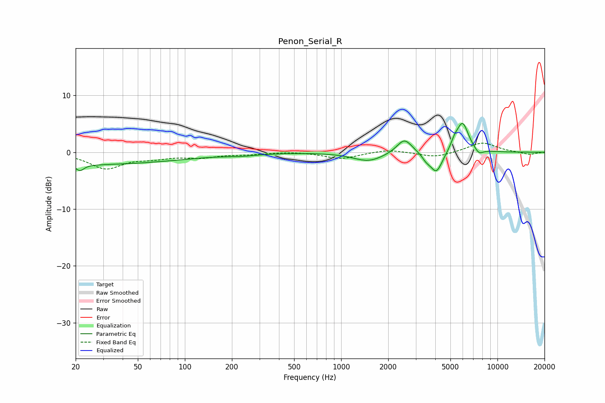

# Penon_Serial_R
See [usage instructions](https://github.com/jaakkopasanen/AutoEq#usage) for more options and info.

### Parametric EQs
Apply preamp of -5.2 dB when using parametric equalizer.

|   # | Type    |   Fc (Hz) |    Q |   Gain (dB) |
|-----|---------|-----------|------|-------------|
|   1 | Peaking |        20 | 0.18 |        -2.2 |
|   2 | Peaking |        21 | 5.71 |        -1   |
|   3 | Peaking |       232 | 1.47 |        -0.3 |
|   4 | Peaking |      1496 | 1.45 |        -1.6 |
|   5 | Peaking |      2539 | 2.89 |         2.6 |
|   6 | Peaking |      3497 | 5.46 |        -0.8 |
|   7 | Peaking |      4066 | 3.53 |        -3.8 |
|   8 | Peaking |      5305 | 5.97 |         1.1 |
|   9 | Peaking |      5978 | 3.49 |         5.2 |
|  10 | Peaking |      7607 | 4.92 |        -1   |

### Fixed Band EQs
When using fixed band (also called graphic) equalizer, apply preamp of **-1.7 dB** (if available) and set gains manually with these parameters.

|   # | Type    |   Fc (Hz) |    Q |   Gain (dB) |
|-----|---------|-----------|------|-------------|
|   1 | Peaking |        31 | 1.41 |        -2.8 |
|   2 | Peaking |        62 | 1.41 |        -0.8 |
|   3 | Peaking |       125 | 1.41 |        -0.8 |
|   4 | Peaking |       250 | 1.41 |        -0.3 |
|   5 | Peaking |       500 | 1.41 |         0.2 |
|   6 | Peaking |      1000 | 1.41 |        -1.1 |
|   7 | Peaking |      2000 | 1.41 |         0.5 |
|   8 | Peaking |      4000 | 1.41 |        -0.9 |
|   9 | Peaking |      8000 | 1.41 |         1.7 |
|  10 | Peaking |     16000 | 1.41 |        -0.4 |

### Graphs

