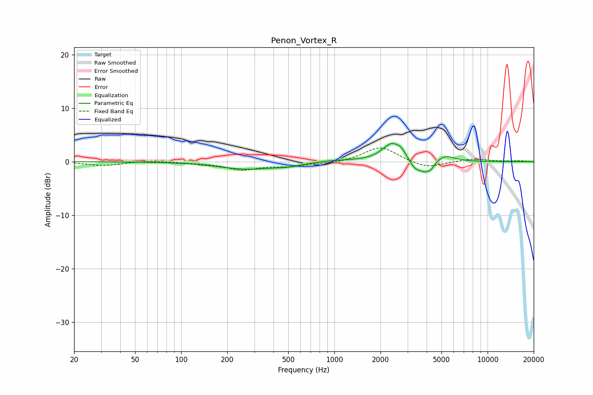

# Penon_Vortex_R
See [usage instructions](https://github.com/jaakkopasanen/AutoEq#usage) for more options and info.

### Parametric EQs
Apply preamp of -3.5 dB when using parametric equalizer.

|   # | Type    |   Fc (Hz) |    Q |   Gain (dB) |
|-----|---------|-----------|------|-------------|
|   1 | Peaking |       266 | 0.77 |        -1.4 |
|   2 | Peaking |       486 | 1.73 |        -0.4 |
|   3 | Peaking |       574 | 1.44 |        -0.2 |
|   4 | Peaking |       973 | 0.88 |         0.3 |
|   5 | Peaking |      2380 | 2.25 |         3.4 |
|   6 | Peaking |      2735 | 6    |         0.8 |
|   7 | Peaking |      3316 | 5.1  |        -1   |
|   8 | Peaking |      3844 | 2.73 |        -2.4 |
|   9 | Peaking |      4269 | 5.92 |        -0.7 |
|  10 | Peaking |      5236 | 2.22 |         1.3 |

### Fixed Band EQs
When using fixed band (also called graphic) equalizer, apply preamp of **-2.7 dB** (if available) and set gains manually with these parameters.

|   # | Type    |   Fc (Hz) |    Q |   Gain (dB) |
|-----|---------|-----------|------|-------------|
|   1 | Peaking |        31 | 1.41 |        -0.7 |
|   2 | Peaking |        62 | 1.41 |         0.2 |
|   3 | Peaking |       125 | 1.41 |        -0.2 |
|   4 | Peaking |       250 | 1.41 |        -1.4 |
|   5 | Peaking |       500 | 1.41 |        -0.8 |
|   6 | Peaking |      1000 | 1.41 |        -0.3 |
|   7 | Peaking |      2000 | 1.41 |         2.9 |
|   8 | Peaking |      4000 | 1.41 |        -1.3 |
|   9 | Peaking |      8000 | 1.41 |         0.6 |
|  10 | Peaking |     16000 | 1.41 |         0.1 |

### Graphs

