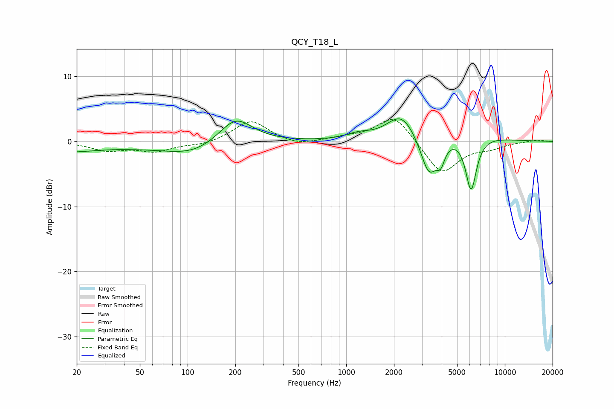

# QCY_T18_L
See [usage instructions](https://github.com/jaakkopasanen/AutoEq#usage) for more options and info.

### Parametric EQs
Apply preamp of -3.6 dB when using parametric equalizer.

|   # | Type    |   Fc (Hz) |    Q |   Gain (dB) |
|-----|---------|-----------|------|-------------|
|   1 | Peaking |        20 | 1.22 |        -0.9 |
|   2 | Peaking |        46 | 0.39 |        -0.8 |
|   3 | Peaking |       109 | 0.88 |        -1.6 |
|   4 | Peaking |       201 | 1.35 |         4   |
|   5 | Peaking |      1193 | 1.9  |         0.8 |
|   6 | Peaking |      2230 | 1.55 |         4.1 |
|   7 | Peaking |      3320 | 2.61 |        -6.3 |
|   8 | Peaking |      3939 | 5.44 |        -2.5 |
|   9 | Peaking |      5414 | 0.77 |         1.6 |
|  10 | Peaking |      6124 | 3.88 |        -8.6 |

### Fixed Band EQs
When using fixed band (also called graphic) equalizer, apply preamp of **-3.4 dB** (if available) and set gains manually with these parameters.

|   # | Type    |   Fc (Hz) |    Q |   Gain (dB) |
|-----|---------|-----------|------|-------------|
|   1 | Peaking |        31 | 1.41 |        -1.3 |
|   2 | Peaking |        62 | 1.41 |        -1.4 |
|   3 | Peaking |       125 | 1.41 |        -0.6 |
|   4 | Peaking |       250 | 1.41 |         3.3 |
|   5 | Peaking |       500 | 1.41 |        -0.7 |
|   6 | Peaking |      1000 | 1.41 |         0.5 |
|   7 | Peaking |      2000 | 1.41 |         4.1 |
|   8 | Peaking |      4000 | 1.41 |        -5.1 |
|   9 | Peaking |      8000 | 1.41 |        -0.8 |
|  10 | Peaking |     16000 | 1.41 |         0.3 |

### Graphs

