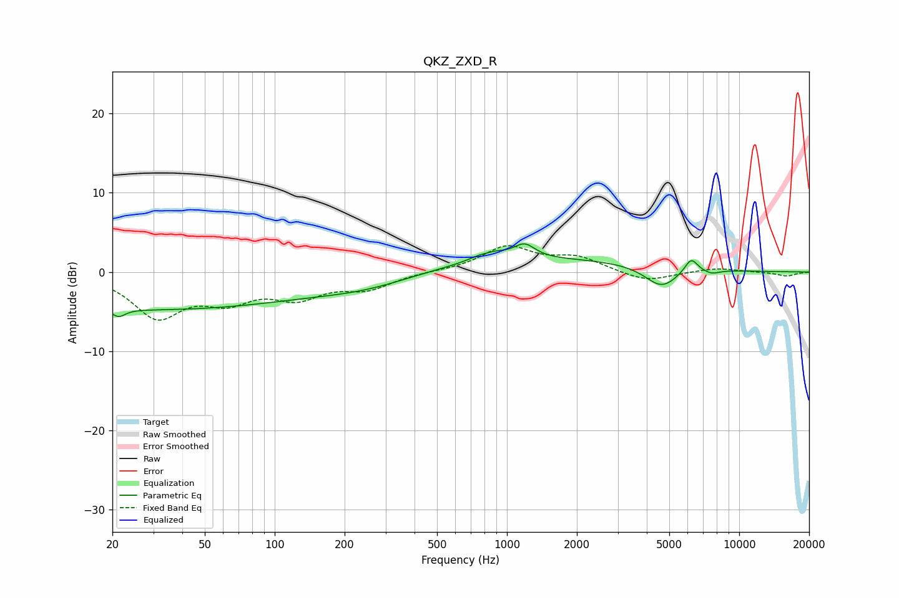

# QKZ_ZXD_R
See [usage instructions](https://github.com/jaakkopasanen/AutoEq#usage) for more options and info.

### Parametric EQs
Apply preamp of -3.6 dB when using parametric equalizer.

|   # | Type    |   Fc (Hz) |    Q |   Gain (dB) |
|-----|---------|-----------|------|-------------|
|   1 | Peaking |        21 | 5.09 |        -1   |
|   2 | Peaking |        29 | 0.19 |        -4.7 |
|   3 | Peaking |       254 | 0.63 |        -1.7 |
|   4 | Peaking |       828 | 5.86 |        -0.2 |
|   5 | Peaking |       838 | 2.14 |         1.2 |
|   6 | Peaking |      1191 | 3.11 |         1.8 |
|   7 | Peaking |      1264 | 0.24 |         1.7 |
|   8 | Peaking |      4626 | 1.96 |        -2.7 |
|   9 | Peaking |      6207 | 4.87 |         1.8 |
|  10 | Peaking |      7604 | 4.01 |        -0.5 |

### Fixed Band EQs
When using fixed band (also called graphic) equalizer, apply preamp of **-3.4 dB** (if available) and set gains manually with these parameters.

|   # | Type    |   Fc (Hz) |    Q |   Gain (dB) |
|-----|---------|-----------|------|-------------|
|   1 | Peaking |        31 | 1.41 |        -5.4 |
|   2 | Peaking |        62 | 1.41 |        -3   |
|   3 | Peaking |       125 | 1.41 |        -2.8 |
|   4 | Peaking |       250 | 1.41 |        -1.9 |
|   5 | Peaking |       500 | 1.41 |         0.1 |
|   6 | Peaking |      1000 | 1.41 |         3.1 |
|   7 | Peaking |      2000 | 1.41 |         1.7 |
|   8 | Peaking |      4000 | 1.41 |        -1.3 |
|   9 | Peaking |      8000 | 1.41 |         0.5 |
|  10 | Peaking |     16000 | 1.41 |        -0.5 |

### Graphs

