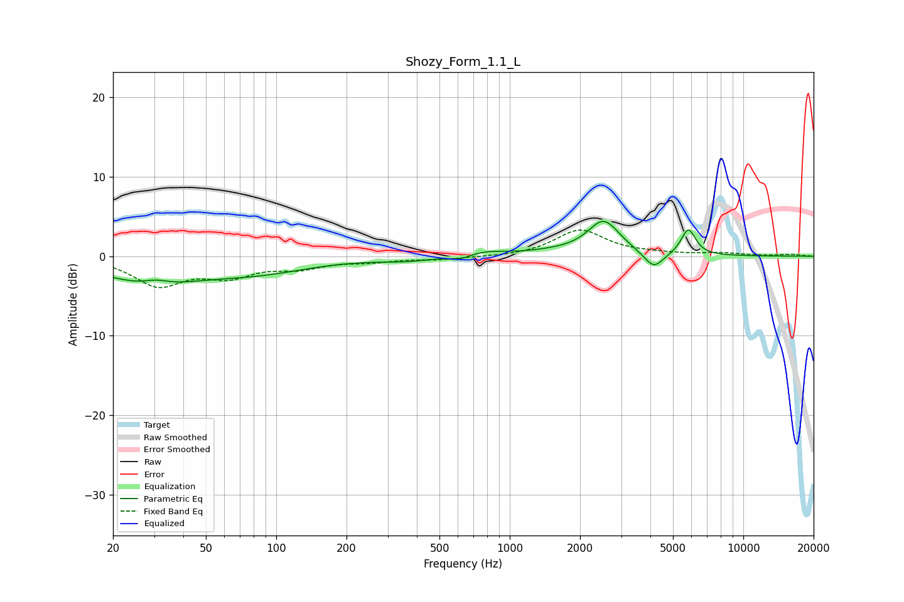

# Shozy_Form_1.1_L
See [usage instructions](https://github.com/jaakkopasanen/AutoEq#usage) for more options and info.

### Parametric EQs
Apply preamp of -4.5 dB when using parametric equalizer.

|   # | Type    |   Fc (Hz) |    Q |   Gain (dB) |
|-----|---------|-----------|------|-------------|
|   1 | Peaking |        29 | 0.67 |        -3.1 |
|   2 | Peaking |        31 | 2.77 |         0.6 |
|   3 | Peaking |        84 | 0.62 |        -1.7 |
|   4 | Peaking |       365 | 1.15 |        -0.5 |
|   5 | Peaking |       622 | 2.72 |        -0.7 |
|   6 | Peaking |       742 | 1.38 |         0.8 |
|   7 | Peaking |      1566 | 1.27 |         0.4 |
|   8 | Peaking |      2524 | 2.05 |         4.3 |
|   9 | Peaking |      4134 | 3.37 |        -2.1 |
|  10 | Peaking |      5816 | 4.47 |         3.3 |

### Fixed Band EQs
When using fixed band (also called graphic) equalizer, apply preamp of **-3.4 dB** (if available) and set gains manually with these parameters.

|   # | Type    |   Fc (Hz) |    Q |   Gain (dB) |
|-----|---------|-----------|------|-------------|
|   1 | Peaking |        31 | 1.41 |        -3.5 |
|   2 | Peaking |        62 | 1.41 |        -2.2 |
|   3 | Peaking |       125 | 1.41 |        -1.2 |
|   4 | Peaking |       250 | 1.41 |        -0.5 |
|   5 | Peaking |       500 | 1.41 |        -0.4 |
|   6 | Peaking |      1000 | 1.41 |        -0.1 |
|   7 | Peaking |      2000 | 1.41 |         3.3 |
|   8 | Peaking |      4000 | 1.41 |         0.2 |
|   9 | Peaking |      8000 | 1.41 |         0.3 |
|  10 | Peaking |     16000 | 1.41 |         0.2 |

### Graphs

