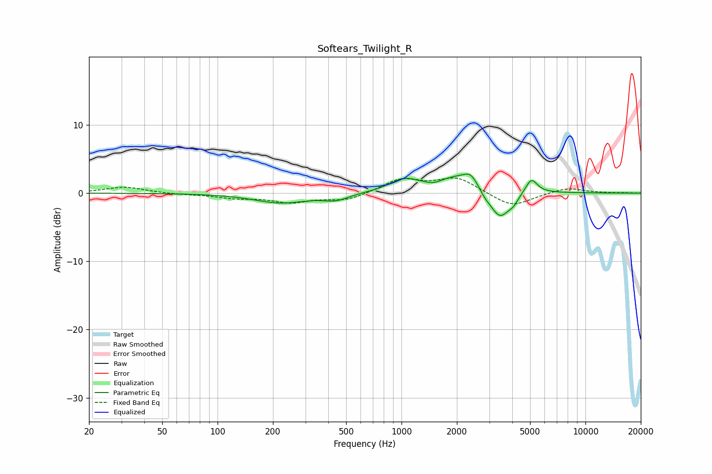

# Softears_Twilight_R
See [usage instructions](https://github.com/jaakkopasanen/AutoEq#usage) for more options and info.

### Parametric EQs
Apply preamp of -2.9 dB when using parametric equalizer.

|   # | Type    |   Fc (Hz) |    Q |   Gain (dB) |
|-----|---------|-----------|------|-------------|
|   1 | Peaking |       222 | 0.97 |        -1.4 |
|   2 | Peaking |       441 | 2.1  |        -0.9 |
|   3 | Peaking |      1026 | 1.88 |         1.6 |
|   4 | Peaking |      1494 | 3.23 |        -0.5 |
|   5 | Peaking |      2205 | 0.95 |         2.9 |
|   6 | Peaking |      2367 | 4.38 |         1   |
|   7 | Peaking |      2838 | 5.06 |        -0.8 |
|   8 | Peaking |      3421 | 2.4  |        -4.8 |
|   9 | Peaking |      4074 | 6    |        -0.7 |
|  10 | Peaking |      5084 | 4.35 |         2.2 |

### Fixed Band EQs
When using fixed band (also called graphic) equalizer, apply preamp of **-2.3 dB** (if available) and set gains manually with these parameters.

|   # | Type    |   Fc (Hz) |    Q |   Gain (dB) |
|-----|---------|-----------|------|-------------|
|   1 | Peaking |        31 | 1.41 |         0.9 |
|   2 | Peaking |        62 | 1.41 |        -0.1 |
|   3 | Peaking |       125 | 1.41 |        -0.6 |
|   4 | Peaking |       250 | 1.41 |        -1.2 |
|   5 | Peaking |       500 | 1.41 |        -1.1 |
|   6 | Peaking |      1000 | 1.41 |         2   |
|   7 | Peaking |      2000 | 1.41 |         2.2 |
|   8 | Peaking |      4000 | 1.41 |        -2.1 |
|   9 | Peaking |      8000 | 1.41 |         0.8 |
|  10 | Peaking |     16000 | 1.41 |         0.1 |

### Graphs

