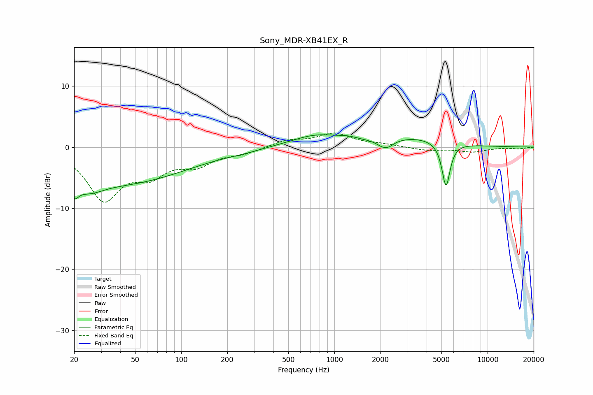

# Sony_MDR-XB41EX_R
See [usage instructions](https://github.com/jaakkopasanen/AutoEq#usage) for more options and info.

### Parametric EQs
Apply preamp of -2.1 dB when using parametric equalizer.

|   # | Type    |   Fc (Hz) |    Q |   Gain (dB) |
|-----|---------|-----------|------|-------------|
|   1 | Peaking |        20 | 5.09 |        -2.4 |
|   2 | Peaking |        25 | 1.44 |        -2.4 |
|   3 | Peaking |        43 | 0.34 |        -5.7 |
|   4 | Peaking |       252 | 1.25 |        -0.3 |
|   5 | Peaking |       768 | 0.83 |         1.9 |
|   6 | Peaking |      1243 | 2.29 |         0.4 |
|   7 | Peaking |      2152 | 5.76 |         0.6 |
|   8 | Peaking |      2158 | 3.53 |        -2.1 |
|   9 | Peaking |      3352 | 0.64 |         1.5 |
|  10 | Peaking |      5355 | 5.23 |        -7.3 |

### Fixed Band EQs
When using fixed band (also called graphic) equalizer, apply preamp of **-2.4 dB** (if available) and set gains manually with these parameters.

|   # | Type    |   Fc (Hz) |    Q |   Gain (dB) |
|-----|---------|-----------|------|-------------|
|   1 | Peaking |        31 | 1.41 |        -8.2 |
|   2 | Peaking |        62 | 1.41 |        -3.7 |
|   3 | Peaking |       125 | 1.41 |        -2.5 |
|   4 | Peaking |       250 | 1.41 |        -0.9 |
|   5 | Peaking |       500 | 1.41 |         1.1 |
|   6 | Peaking |      1000 | 1.41 |         2.1 |
|   7 | Peaking |      2000 | 1.41 |         0.4 |
|   8 | Peaking |      4000 | 1.41 |        -0.5 |
|   9 | Peaking |      8000 | 1.41 |        -0.8 |
|  10 | Peaking |     16000 | 1.41 |        -0.3 |

### Graphs

