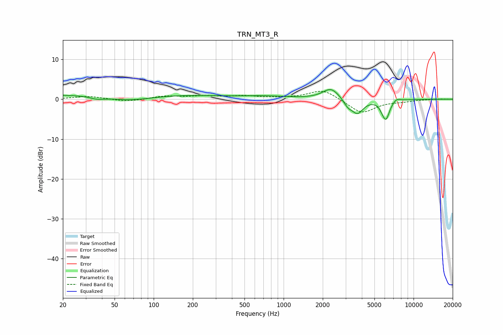

# TRN_MT3_R
See [usage instructions](https://github.com/jaakkopasanen/AutoEq#usage) for more options and info.

### Parametric EQs
Apply preamp of -2.5 dB when using parametric equalizer.

|   # | Type    |   Fc (Hz) |    Q |   Gain (dB) |
|-----|---------|-----------|------|-------------|
|   1 | Peaking |        37 | 2.64 |        -0.6 |
|   2 | Peaking |        58 | 0.18 |         1.6 |
|   3 | Peaking |        65 | 0.75 |        -1.6 |
|   4 | Peaking |       727 | 0.77 |         0.6 |
|   5 | Peaking |      2315 | 2.25 |         2.8 |
|   6 | Peaking |      3122 | 4.44 |        -1.5 |
|   7 | Peaking |      3698 | 3.16 |        -3.5 |
|   8 | Peaking |      5758 | 6    |        -1   |
|   9 | Peaking |      6145 | 5.04 |        -4.4 |
|  10 | Peaking |      7428 | 4.94 |         0.7 |

### Fixed Band EQs
When using fixed band (also called graphic) equalizer, apply preamp of **-2.1 dB** (if available) and set gains manually with these parameters.

|   # | Type    |   Fc (Hz) |    Q |   Gain (dB) |
|-----|---------|-----------|------|-------------|
|   1 | Peaking |        31 | 1.41 |         0.7 |
|   2 | Peaking |        62 | 1.41 |        -0.6 |
|   3 | Peaking |       125 | 1.41 |         0.8 |
|   4 | Peaking |       250 | 1.41 |         0.7 |
|   5 | Peaking |       500 | 1.41 |         0.7 |
|   6 | Peaking |      1000 | 1.41 |         0.2 |
|   7 | Peaking |      2000 | 1.41 |         2.5 |
|   8 | Peaking |      4000 | 1.41 |        -3.6 |
|   9 | Peaking |      8000 | 1.41 |        -0.4 |
|  10 | Peaking |     16000 | 1.41 |         0.1 |

### Graphs

