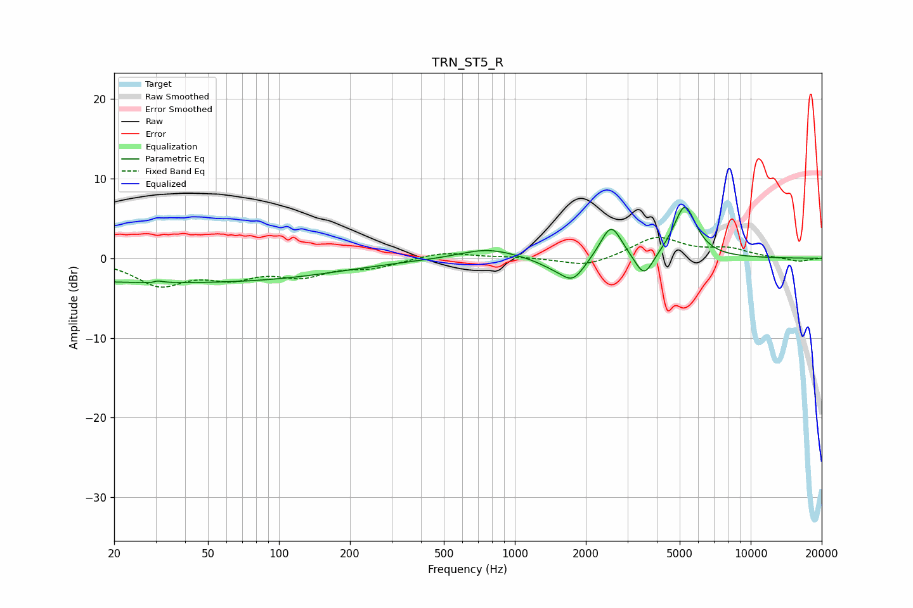

# TRN_ST5_R
See [usage instructions](https://github.com/jaakkopasanen/AutoEq#usage) for more options and info.

### Parametric EQs
Apply preamp of -6.5 dB when using parametric equalizer.

|   # | Type    |   Fc (Hz) |    Q |   Gain (dB) |
|-----|---------|-----------|------|-------------|
|   1 | Peaking |        25 | 0.2  |        -2.9 |
|   2 | Peaking |        30 | 5.8  |        -2.7 |
|   3 | Peaking |        30 | 5.89 |         2.9 |
|   4 | Peaking |       137 | 0.48 |        -0.8 |
|   5 | Peaking |       763 | 1.19 |         1.3 |
|   6 | Peaking |      1456 | 1.94 |        -0.9 |
|   7 | Peaking |      1764 | 2.78 |        -2.7 |
|   8 | Peaking |      2559 | 3.18 |         4.3 |
|   9 | Peaking |      3532 | 3.64 |        -3.2 |
|  10 | Peaking |      5256 | 2.92 |         6.6 |

### Fixed Band EQs
When using fixed band (also called graphic) equalizer, apply preamp of **-2.7 dB** (if available) and set gains manually with these parameters.

|   # | Type    |   Fc (Hz) |    Q |   Gain (dB) |
|-----|---------|-----------|------|-------------|
|   1 | Peaking |        31 | 1.41 |        -3.2 |
|   2 | Peaking |        62 | 1.41 |        -2   |
|   3 | Peaking |       125 | 1.41 |        -1.9 |
|   4 | Peaking |       250 | 1.41 |        -1   |
|   5 | Peaking |       500 | 1.41 |         0.8 |
|   6 | Peaking |      1000 | 1.41 |         0.2 |
|   7 | Peaking |      2000 | 1.41 |        -1.1 |
|   8 | Peaking |      4000 | 1.41 |         2.6 |
|   9 | Peaking |      8000 | 1.41 |         1.1 |
|  10 | Peaking |     16000 | 1.41 |        -0.4 |

### Graphs

