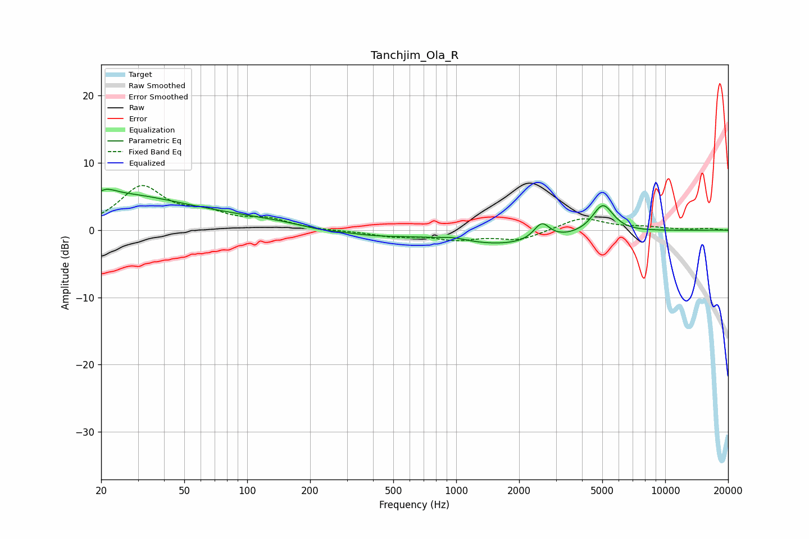

# Tanchjim_Ola_R
See [usage instructions](https://github.com/jaakkopasanen/AutoEq#usage) for more options and info.

### Parametric EQs
Apply preamp of -6.2 dB when using parametric equalizer.

|   # | Type    |   Fc (Hz) |    Q |   Gain (dB) |
|-----|---------|-----------|------|-------------|
|   1 | Peaking |        20 | 0.42 |         4.2 |
|   2 | Peaking |        22 | 5.51 |         3.4 |
|   3 | Peaking |        22 | 6    |        -2.8 |
|   4 | Peaking |        67 | 0.22 |         1.7 |
|   5 | Peaking |       220 | 1.27 |        -0.6 |
|   6 | Peaking |       388 | 0.87 |        -0.9 |
|   7 | Peaking |       966 | 2.08 |         0.5 |
|   8 | Peaking |      1709 | 0.51 |        -2.2 |
|   9 | Peaking |      2567 | 3.74 |         2.6 |
|  10 | Peaking |      5030 | 2.73 |         4.3 |

### Fixed Band EQs
When using fixed band (also called graphic) equalizer, apply preamp of **-6.7 dB** (if available) and set gains manually with these parameters.

|   # | Type    |   Fc (Hz) |    Q |   Gain (dB) |
|-----|---------|-----------|------|-------------|
|   1 | Peaking |        31 | 1.41 |         6.2 |
|   2 | Peaking |        62 | 1.41 |         2   |
|   3 | Peaking |       125 | 1.41 |         1.4 |
|   4 | Peaking |       250 | 1.41 |        -0.1 |
|   5 | Peaking |       500 | 1.41 |        -0.9 |
|   6 | Peaking |      1000 | 1.41 |        -1.2 |
|   7 | Peaking |      2000 | 1.41 |        -1.4 |
|   8 | Peaking |      4000 | 1.41 |         1.9 |
|   9 | Peaking |      8000 | 1.41 |         0.4 |
|  10 | Peaking |     16000 | 1.41 |         0.2 |

### Graphs

