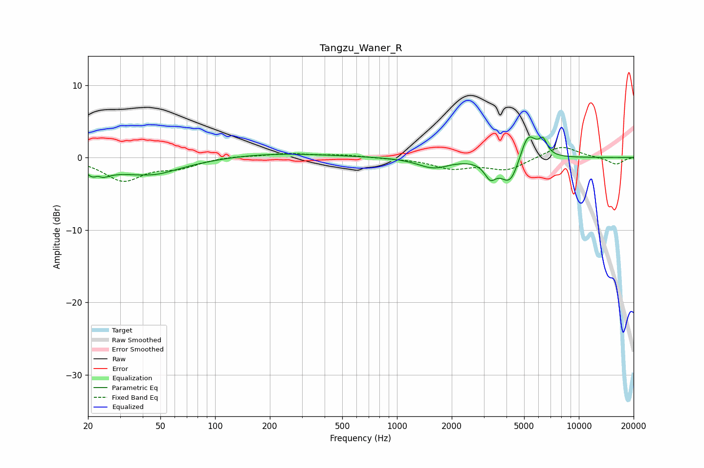

# Tangzu_Waner_R
See [usage instructions](https://github.com/jaakkopasanen/AutoEq#usage) for more options and info.

### Parametric EQs
Apply preamp of -2.9 dB when using parametric equalizer.

|   # | Type    |   Fc (Hz) |    Q |   Gain (dB) |
|-----|---------|-----------|------|-------------|
|   1 | Peaking |        22 | 3.25 |        -2.6 |
|   2 | Peaking |        23 | 5.99 |         1.3 |
|   3 | Peaking |        41 | 0.65 |        -2.3 |
|   4 | Peaking |        49 | 2.09 |        -0.2 |
|   5 | Peaking |       202 | 0.45 |         0.6 |
|   6 | Peaking |      1587 | 1.64 |        -1.4 |
|   7 | Peaking |      3259 | 4.5  |        -2.1 |
|   8 | Peaking |      4199 | 2.63 |        -3.9 |
|   9 | Peaking |      5240 | 3.03 |         4.1 |
|  10 | Peaking |      6356 | 6    |         1.9 |

### Fixed Band EQs
When using fixed band (also called graphic) equalizer, apply preamp of **-1.5 dB** (if available) and set gains manually with these parameters.

|   # | Type    |   Fc (Hz) |    Q |   Gain (dB) |
|-----|---------|-----------|------|-------------|
|   1 | Peaking |        31 | 1.41 |        -3.1 |
|   2 | Peaking |        62 | 1.41 |        -1.2 |
|   3 | Peaking |       125 | 1.41 |         0.2 |
|   4 | Peaking |       250 | 1.41 |         0.5 |
|   5 | Peaking |       500 | 1.41 |         0.3 |
|   6 | Peaking |      1000 | 1.41 |        -0.1 |
|   7 | Peaking |      2000 | 1.41 |        -1.4 |
|   8 | Peaking |      4000 | 1.41 |        -1.7 |
|   9 | Peaking |      8000 | 1.41 |         1.7 |
|  10 | Peaking |     16000 | 1.41 |        -1   |

### Graphs

