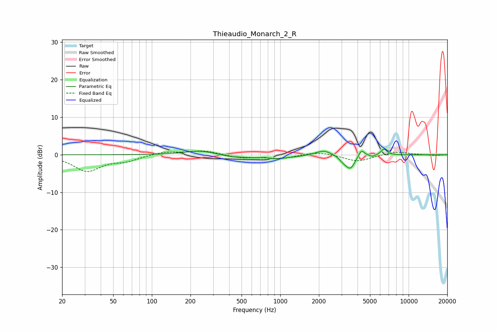

# Thieaudio_Monarch_2_R
See [usage instructions](https://github.com/jaakkopasanen/AutoEq#usage) for more options and info.

### Parametric EQs
Apply preamp of -1.6 dB when using parametric equalizer.

|   # | Type    |   Fc (Hz) |    Q |   Gain (dB) |
|-----|---------|-----------|------|-------------|
|   1 | Peaking |       235 | 1.23 |         1.1 |
|   2 | Peaking |       418 | 1.78 |        -0.4 |
|   3 | Peaking |       750 | 4.73 |         0.4 |
|   4 | Peaking |       845 | 0.94 |        -1.2 |
|   5 | Peaking |      2181 | 2.31 |         1.4 |
|   6 | Peaking |      3105 | 4.41 |        -1.1 |
|   7 | Peaking |      3520 | 3.88 |        -3.5 |
|   8 | Peaking |      4289 | 6    |         1.9 |
|   9 | Peaking |      5234 | 6    |        -0.5 |
|  10 | Peaking |      6427 | 6    |         1.6 |

### Fixed Band EQs
When using fixed band (also called graphic) equalizer, apply preamp of **-1.1 dB** (if available) and set gains manually with these parameters.

|   # | Type    |   Fc (Hz) |    Q |   Gain (dB) |
|-----|---------|-----------|------|-------------|
|   1 | Peaking |        31 | 1.41 |        -4.3 |
|   2 | Peaking |        62 | 1.41 |        -1.4 |
|   3 | Peaking |       125 | 1.41 |         0.8 |
|   4 | Peaking |       250 | 1.41 |         1.1 |
|   5 | Peaking |       500 | 1.41 |        -0.8 |
|   6 | Peaking |      1000 | 1.41 |        -1   |
|   7 | Peaking |      2000 | 1.41 |         0.9 |
|   8 | Peaking |      4000 | 1.41 |        -1.8 |
|   9 | Peaking |      8000 | 1.41 |         0.9 |
|  10 | Peaking |     16000 | 1.41 |        -0.2 |

### Graphs

