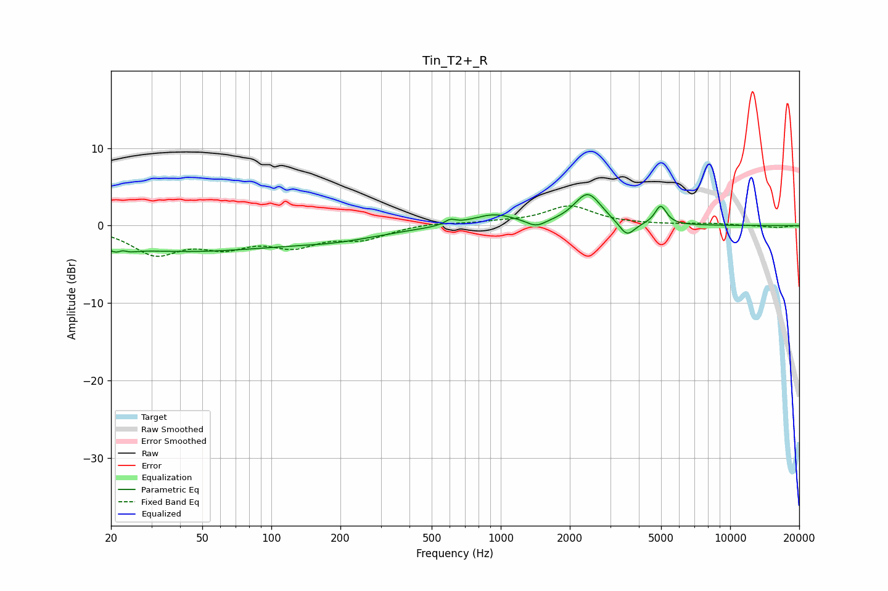

# Tin_T2+_R
See [usage instructions](https://github.com/jaakkopasanen/AutoEq#usage) for more options and info.

### Parametric EQs
Apply preamp of -4.1 dB when using parametric equalizer.

|   # | Type    |   Fc (Hz) |    Q |   Gain (dB) |
|-----|---------|-----------|------|-------------|
|   1 | Peaking |        22 | 4.37 |        -3.2 |
|   2 | Peaking |        22 | 5.46 |         2.7 |
|   3 | Peaking |        41 | 0.32 |        -3.2 |
|   4 | Peaking |       196 | 0.7  |        -1.2 |
|   5 | Peaking |       602 | 5.86 |         0.6 |
|   6 | Peaking |       933 | 1.47 |         1.5 |
|   7 | Peaking |      1427 | 3.45 |        -0.9 |
|   8 | Peaking |      2396 | 2.4  |         4.1 |
|   9 | Peaking |      3547 | 4.15 |        -2   |
|  10 | Peaking |      4980 | 5.58 |         2.4 |

### Fixed Band EQs
When using fixed band (also called graphic) equalizer, apply preamp of **-2.6 dB** (if available) and set gains manually with these parameters.

|   # | Type    |   Fc (Hz) |    Q |   Gain (dB) |
|-----|---------|-----------|------|-------------|
|   1 | Peaking |        31 | 1.41 |        -3.5 |
|   2 | Peaking |        62 | 1.41 |        -2.3 |
|   3 | Peaking |       125 | 1.41 |        -2.3 |
|   4 | Peaking |       250 | 1.41 |        -1.5 |
|   5 | Peaking |       500 | 1.41 |         0.4 |
|   6 | Peaking |      1000 | 1.41 |         0.3 |
|   7 | Peaking |      2000 | 1.41 |         2.5 |
|   8 | Peaking |      4000 | 1.41 |         0.1 |
|   9 | Peaking |      8000 | 1.41 |         0.2 |
|  10 | Peaking |     16000 | 1.41 |        -0.3 |

### Graphs

