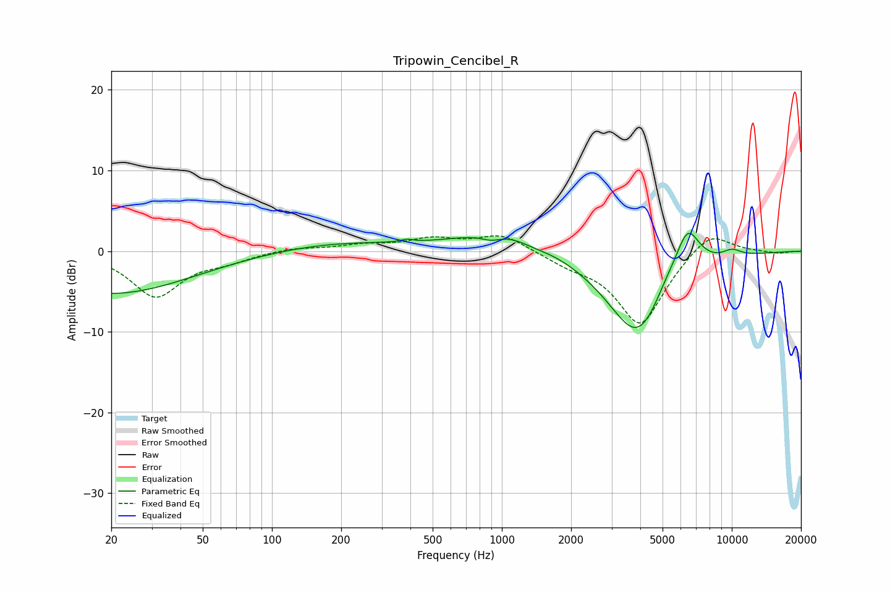

# Tripowin_Cencibel_R
See [usage instructions](https://github.com/jaakkopasanen/AutoEq#usage) for more options and info.

### Parametric EQs
Apply preamp of -2.3 dB when using parametric equalizer.

|   # | Type    |   Fc (Hz) |    Q |   Gain (dB) |
|-----|---------|-----------|------|-------------|
|   1 | Peaking |        20 | 0.4  |        -5.3 |
|   2 | Peaking |       188 | 0.49 |         1.1 |
|   3 | Peaking |       387 | 5.83 |         0.3 |
|   4 | Peaking |       898 | 3.05 |        -0.8 |
|   5 | Peaking |      1073 | 0.72 |         3   |
|   6 | Peaking |      1358 | 1.87 |        -0.6 |
|   7 | Peaking |      3889 | 1.02 |       -10.9 |
|   8 | Peaking |      5138 | 2.71 |         1.2 |
|   9 | Peaking |      6403 | 2.41 |         6.2 |
|  10 | Peaking |     10000 | 2.95 |         0.9 |

### Fixed Band EQs
When using fixed band (also called graphic) equalizer, apply preamp of **-2.0 dB** (if available) and set gains manually with these parameters.

|   # | Type    |   Fc (Hz) |    Q |   Gain (dB) |
|-----|---------|-----------|------|-------------|
|   1 | Peaking |        31 | 1.41 |        -5.6 |
|   2 | Peaking |        62 | 1.41 |        -1   |
|   3 | Peaking |       125 | 1.41 |         0.4 |
|   4 | Peaking |       250 | 1.41 |         0.7 |
|   5 | Peaking |       500 | 1.41 |         1.4 |
|   6 | Peaking |      1000 | 1.41 |         2.1 |
|   7 | Peaking |      2000 | 1.41 |        -1.2 |
|   8 | Peaking |      4000 | 1.41 |        -9.2 |
|   9 | Peaking |      8000 | 1.41 |         2.9 |
|  10 | Peaking |     16000 | 1.41 |        -0.3 |

### Graphs

