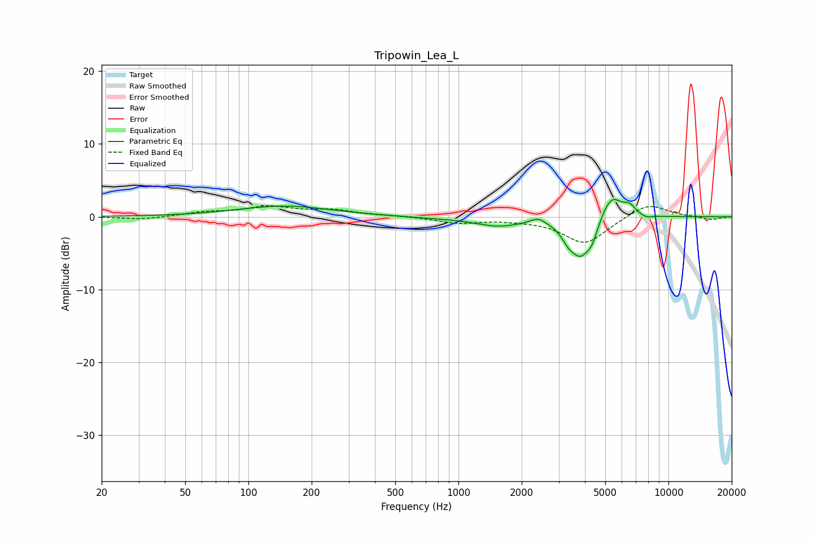

# Tripowin_Lea_L
See [usage instructions](https://github.com/jaakkopasanen/AutoEq#usage) for more options and info.

### Parametric EQs
Apply preamp of -2.5 dB when using parametric equalizer.

|   # | Type    |   Fc (Hz) |    Q |   Gain (dB) |
|-----|---------|-----------|------|-------------|
|   1 | Peaking |       149 | 0.64 |         1.5 |
|   2 | Peaking |       786 | 0.91 |        -0.2 |
|   3 | Peaking |      1546 | 1.28 |        -1.2 |
|   4 | Peaking |      2397 | 3.96 |         0.8 |
|   5 | Peaking |      3312 | 5.24 |        -1   |
|   6 | Peaking |      3800 | 2.56 |        -5.3 |
|   7 | Peaking |      4334 | 5.44 |        -1.6 |
|   8 | Peaking |      5342 | 2.71 |         3.5 |
|   9 | Peaking |      6526 | 4.98 |         1.1 |
|  10 | Peaking |      7862 | 5.42 |        -0.4 |

### Fixed Band EQs
When using fixed band (also called graphic) equalizer, apply preamp of **-1.6 dB** (if available) and set gains manually with these parameters.

|   # | Type    |   Fc (Hz) |    Q |   Gain (dB) |
|-----|---------|-----------|------|-------------|
|   1 | Peaking |        31 | 1.41 |        -0.4 |
|   2 | Peaking |        62 | 1.41 |         0.6 |
|   3 | Peaking |       125 | 1.41 |         1.3 |
|   4 | Peaking |       250 | 1.41 |         0.8 |
|   5 | Peaking |       500 | 1.41 |         0.1 |
|   6 | Peaking |      1000 | 1.41 |        -0.8 |
|   7 | Peaking |      2000 | 1.41 |        -0.2 |
|   8 | Peaking |      4000 | 1.41 |        -3.7 |
|   9 | Peaking |      8000 | 1.41 |         1.9 |
|  10 | Peaking |     16000 | 1.41 |        -0.4 |

### Graphs

