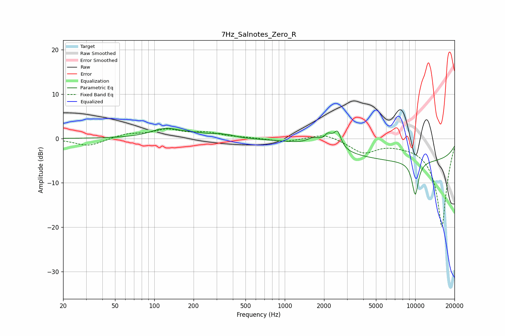

# 7Hz_Salnotes_Zero_R
See [usage instructions](https://github.com/jaakkopasanen/AutoEq#usage) for more options and info.

### Parametric EQs
Apply preamp of -2.4 dB when using parametric equalizer.

|   # | Type    |   Fc (Hz) |    Q |   Gain (dB) |
|-----|---------|-----------|------|-------------|
|   1 | Peaking |       122 | 1.28 |         2   |
|   2 | Peaking |       210 | 1.3  |         0.7 |
|   3 | Peaking |       343 | 2.51 |         1   |
|   4 | Peaking |       347 | 5.92 |        -0.3 |
|   5 | Peaking |      1644 | 2.99 |         1.3 |
|   6 | Peaking |      2002 | 5.98 |        -0.9 |
|   7 | Peaking |      2109 | 3.55 |         3.3 |
|   8 | Peaking |      2540 | 5.44 |         3.4 |
|   9 | Peaking |     10000 | 0.18 |        -5.1 |
|  10 | Peaking |     10000 | 4.79 |        -7.6 |

### Fixed Band EQs
When using fixed band (also called graphic) equalizer, apply preamp of **-2.2 dB** (if available) and set gains manually with these parameters.

|   # | Type    |   Fc (Hz) |    Q |   Gain (dB) |
|-----|---------|-----------|------|-------------|
|   1 | Peaking |        31 | 1.41 |        -1.7 |
|   2 | Peaking |        62 | 1.41 |         1   |
|   3 | Peaking |       125 | 1.41 |         1.8 |
|   4 | Peaking |       250 | 1.41 |         1.2 |
|   5 | Peaking |       500 | 1.41 |         0.1 |
|   6 | Peaking |      1000 | 1.41 |        -0.8 |
|   7 | Peaking |      2000 | 1.41 |         1.3 |
|   8 | Peaking |      4000 | 1.41 |        -3   |
|   9 | Peaking |      8000 | 1.41 |        -0.4 |
|  10 | Peaking |     16000 | 1.41 |       -20   |

### Graphs

