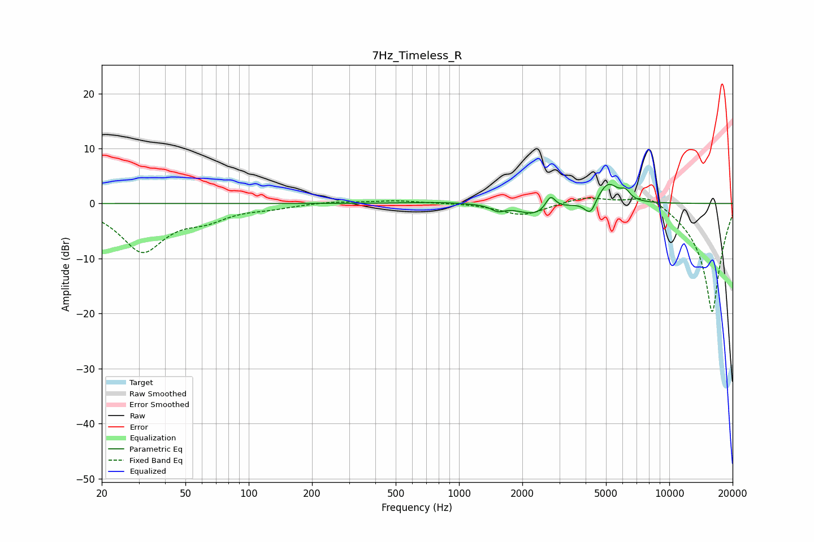

# 7Hz_Timeless_R
See [usage instructions](https://github.com/jaakkopasanen/AutoEq#usage) for more options and info.

### Parametric EQs
Apply preamp of -3.6 dB when using parametric equalizer.

|   # | Type    |   Fc (Hz) |    Q |   Gain (dB) |
|-----|---------|-----------|------|-------------|
|   1 | Peaking |       802 | 0.93 |         0.3 |
|   2 | Peaking |      1529 | 4.65 |        -1   |
|   3 | Peaking |      2322 | 1.69 |        -2.1 |
|   4 | Peaking |      2723 | 6    |         2.6 |
|   5 | Peaking |      4114 | 5.04 |        -0.8 |
|   6 | Peaking |      4129 | 5.97 |        -0.5 |
|   7 | Peaking |      4311 | 5.98 |        -2.4 |
|   8 | Peaking |      4386 | 6    |         1   |
|   9 | Peaking |      5115 | 2.96 |         3.8 |
|  10 | Peaking |      6179 | 6    |         1.5 |

### Fixed Band EQs
When using fixed band (also called graphic) equalizer, apply preamp of **-1.1 dB** (if available) and set gains manually with these parameters.

|   # | Type    |   Fc (Hz) |    Q |   Gain (dB) |
|-----|---------|-----------|------|-------------|
|   1 | Peaking |        31 | 1.41 |        -8.5 |
|   2 | Peaking |        62 | 1.41 |        -2.2 |
|   3 | Peaking |       125 | 1.41 |        -0.6 |
|   4 | Peaking |       250 | 1.41 |         0.4 |
|   5 | Peaking |       500 | 1.41 |         0.5 |
|   6 | Peaking |      1000 | 1.41 |         0.1 |
|   7 | Peaking |      2000 | 1.41 |        -2.2 |
|   8 | Peaking |      4000 | 1.41 |         1.4 |
|   9 | Peaking |      8000 | 1.41 |         2.4 |
|  10 | Peaking |     16000 | 1.41 |       -20   |

### Graphs

