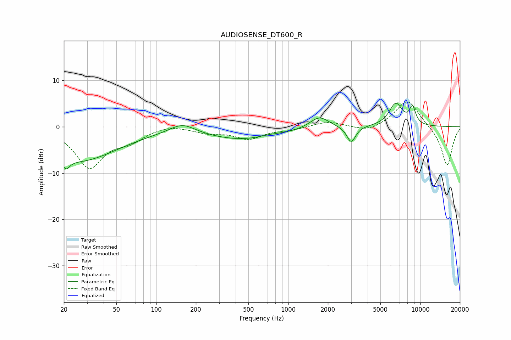

# AUDIOSENSE_DT600_R
See [usage instructions](https://github.com/jaakkopasanen/AutoEq#usage) for more options and info.

### Parametric EQs
Apply preamp of -5.2 dB when using parametric equalizer.

|   # | Type    |   Fc (Hz) |    Q |   Gain (dB) |
|-----|---------|-----------|------|-------------|
|   1 | Peaking |        21 | 5.17 |        -2.1 |
|   2 | Peaking |        26 | 0.47 |        -7.3 |
|   3 | Peaking |       158 | 1.48 |         2.2 |
|   4 | Peaking |       458 | 0.49 |        -2.7 |
|   5 | Peaking |       715 | 1.76 |         0.4 |
|   6 | Peaking |      1722 | 1.97 |         2.6 |
|   7 | Peaking |      2967 | 4.02 |        -0.8 |
|   8 | Peaking |      3014 | 4.36 |        -2.7 |
|   9 | Peaking |      6538 | 2.68 |         4.9 |
|  10 | Peaking |      8754 | 5.32 |         3.6 |

### Fixed Band EQs
When using fixed band (also called graphic) equalizer, apply preamp of **-5.5 dB** (if available) and set gains manually with these parameters.

|   # | Type    |   Fc (Hz) |    Q |   Gain (dB) |
|-----|---------|-----------|------|-------------|
|   1 | Peaking |        31 | 1.41 |        -8.6 |
|   2 | Peaking |        62 | 1.41 |        -2.5 |
|   3 | Peaking |       125 | 1.41 |         0.7 |
|   4 | Peaking |       250 | 1.41 |        -1.2 |
|   5 | Peaking |       500 | 1.41 |        -2.4 |
|   6 | Peaking |      1000 | 1.41 |        -0.6 |
|   7 | Peaking |      2000 | 1.41 |         1.2 |
|   8 | Peaking |      4000 | 1.41 |        -1.2 |
|   9 | Peaking |      8000 | 1.41 |         6   |
|  10 | Peaking |     16000 | 1.41 |        -8.6 |

### Graphs

