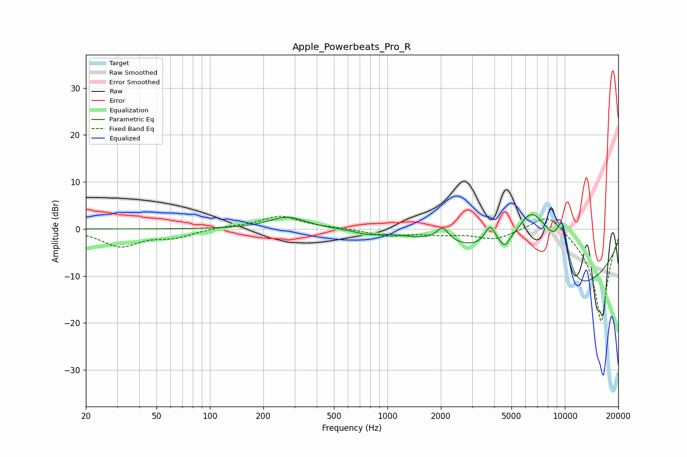

# Apple_Powerbeats_Pro_R
See [usage instructions](https://github.com/jaakkopasanen/AutoEq#usage) for more options and info.

### Parametric EQs
Apply preamp of -3.1 dB when using parametric equalizer.

|   # | Type    |   Fc (Hz) |    Q |   Gain (dB) |
|-----|---------|-----------|------|-------------|
|   1 | Peaking |       273 | 1.35 |         2.6 |
|   2 | Peaking |       766 | 2.41 |        -0.7 |
|   3 | Peaking |      2044 | 4.09 |         3   |
|   4 | Peaking |      3786 | 4.61 |         4.1 |
|   5 | Peaking |      4584 | 5.99 |        -1.8 |
|   6 | Peaking |      6355 | 1.72 |         6.7 |
|   7 | Peaking |      7649 | 0.89 |        11.9 |
|   8 | Peaking |      9566 | 3.51 |         5.3 |
|   9 | Peaking |      9824 | 3.95 |         4.9 |
|  10 | Peaking |     10000 | 0.39 |       -19.2 |

### Fixed Band EQs
When using fixed band (also called graphic) equalizer, apply preamp of **-2.8 dB** (if available) and set gains manually with these parameters.

|   # | Type    |   Fc (Hz) |    Q |   Gain (dB) |
|-----|---------|-----------|------|-------------|
|   1 | Peaking |        31 | 1.41 |        -3.6 |
|   2 | Peaking |        62 | 1.41 |        -1.6 |
|   3 | Peaking |       125 | 1.41 |         0.4 |
|   4 | Peaking |       250 | 1.41 |         2.7 |
|   5 | Peaking |       500 | 1.41 |         0.2 |
|   6 | Peaking |      1000 | 1.41 |        -1.4 |
|   7 | Peaking |      2000 | 1.41 |        -0.9 |
|   8 | Peaking |      4000 | 1.41 |        -2.1 |
|   9 | Peaking |      8000 | 1.41 |         4.2 |
|  10 | Peaking |     16000 | 1.41 |       -20   |

### Graphs

