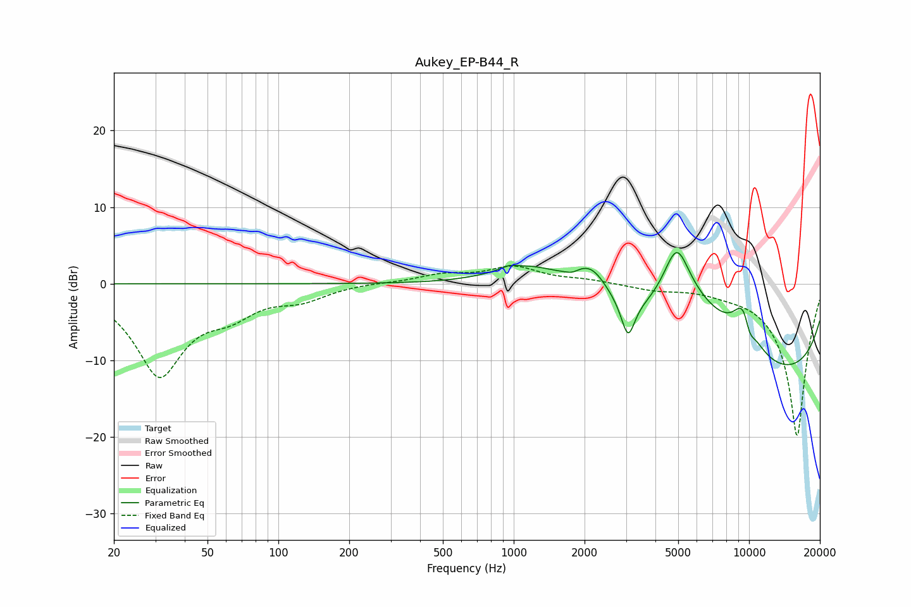

# Aukey_EP-B44_R
See [usage instructions](https://github.com/jaakkopasanen/AutoEq#usage) for more options and info.

### Parametric EQs
Apply preamp of -4.2 dB when using parametric equalizer.

|   # | Type    |   Fc (Hz) |    Q |   Gain (dB) |
|-----|---------|-----------|------|-------------|
|   1 | Peaking |       950 | 4.76 |         0.4 |
|   2 | Peaking |      1206 | 0.84 |         4.3 |
|   3 | Peaking |      1771 | 5.96 |        -0.3 |
|   4 | Peaking |      2133 | 1.81 |         4.5 |
|   5 | Peaking |      3061 | 4.99 |        -4.9 |
|   6 | Peaking |      4924 | 2.35 |         8.1 |
|   7 | Peaking |      6016 | 0.68 |         7.3 |
|   8 | Peaking |      9607 | 2.71 |         7.1 |
|   9 | Peaking |     10000 | 4.67 |        -3.6 |
|  10 | Peaking |     10000 | 0.18 |       -13.3 |

### Fixed Band EQs
When using fixed band (also called graphic) equalizer, apply preamp of **-2.4 dB** (if available) and set gains manually with these parameters.

|   # | Type    |   Fc (Hz) |    Q |   Gain (dB) |
|-----|---------|-----------|------|-------------|
|   1 | Peaking |        31 | 1.41 |       -11.7 |
|   2 | Peaking |        62 | 1.41 |        -2.8 |
|   3 | Peaking |       125 | 1.41 |        -1.7 |
|   4 | Peaking |       250 | 1.41 |         0.2 |
|   5 | Peaking |       500 | 1.41 |         1.1 |
|   6 | Peaking |      1000 | 1.41 |         2.1 |
|   7 | Peaking |      2000 | 1.41 |         0.5 |
|   8 | Peaking |      4000 | 1.41 |        -0.7 |
|   9 | Peaking |      8000 | 1.41 |        -0.5 |
|  10 | Peaking |     16000 | 1.41 |       -20   |

### Graphs

