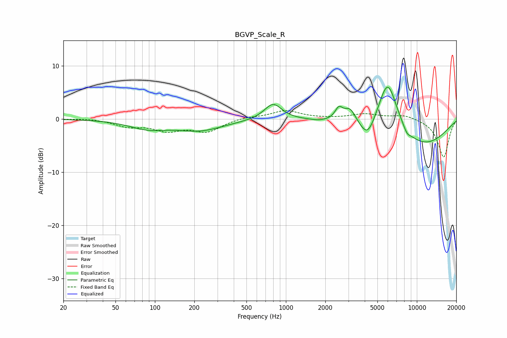

# BGVP_Scale_R
See [usage instructions](https://github.com/jaakkopasanen/AutoEq#usage) for more options and info.

### Parametric EQs
Apply preamp of -6.1 dB when using parametric equalizer.

|   # | Type    |   Fc (Hz) |    Q |   Gain (dB) |
|-----|---------|-----------|------|-------------|
|   1 | Peaking |        88 | 0.99 |        -1.6 |
|   2 | Peaking |       221 | 0.77 |        -2   |
|   3 | Peaking |       798 | 2.13 |         3.1 |
|   4 | Peaking |      1774 | 2.66 |        -0.2 |
|   5 | Peaking |      2538 | 4.88 |         2.1 |
|   6 | Peaking |      3085 | 3.14 |         2.6 |
|   7 | Peaking |      4217 | 2.34 |        -4   |
|   8 | Peaking |      5989 | 1.68 |        10.9 |
|   9 | Peaking |      8405 | 5.06 |        -0.9 |
|  10 | Peaking |      9903 | 0.45 |        -5.6 |

### Fixed Band EQs
When using fixed band (also called graphic) equalizer, apply preamp of **-1.7 dB** (if available) and set gains manually with these parameters.

|   # | Type    |   Fc (Hz) |    Q |   Gain (dB) |
|-----|---------|-----------|------|-------------|
|   1 | Peaking |        31 | 1.41 |         0.2 |
|   2 | Peaking |        62 | 1.41 |        -1.2 |
|   3 | Peaking |       125 | 1.41 |        -1.9 |
|   4 | Peaking |       250 | 1.41 |        -2.2 |
|   5 | Peaking |       500 | 1.41 |         0.4 |
|   6 | Peaking |      1000 | 1.41 |         1.6 |
|   7 | Peaking |      2000 | 1.41 |         0.1 |
|   8 | Peaking |      4000 | 1.41 |         0.9 |
|   9 | Peaking |      8000 | 1.41 |         0.8 |
|  10 | Peaking |     16000 | 1.41 |        -7.2 |

### Graphs

