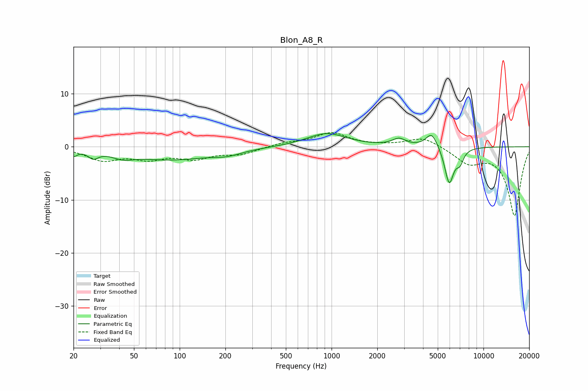

# Blon_A8_R
See [usage instructions](https://github.com/jaakkopasanen/AutoEq#usage) for more options and info.

### Parametric EQs
Apply preamp of -2.6 dB when using parametric equalizer.

|   # | Type    |   Fc (Hz) |    Q |   Gain (dB) |
|-----|---------|-----------|------|-------------|
|   1 | Peaking |        20 | 6    |        -1.2 |
|   2 | Peaking |        27 | 4.31 |        -1.4 |
|   3 | Peaking |        42 | 2.02 |        -1.1 |
|   4 | Peaking |        87 | 0.54 |        -2.3 |
|   5 | Peaking |       206 | 1.48 |        -0.9 |
|   6 | Peaking |       927 | 1.09 |         2.5 |
|   7 | Peaking |      2777 | 3.21 |         1.3 |
|   8 | Peaking |      4569 | 3.65 |         2.9 |
|   9 | Peaking |      5950 | 4.57 |        -7   |
|  10 | Peaking |      6995 | 5.83 |        -2.2 |

### Fixed Band EQs
When using fixed band (also called graphic) equalizer, apply preamp of **-2.8 dB** (if available) and set gains manually with these parameters.

|   # | Type    |   Fc (Hz) |    Q |   Gain (dB) |
|-----|---------|-----------|------|-------------|
|   1 | Peaking |        31 | 1.41 |        -2.3 |
|   2 | Peaking |        62 | 1.41 |        -1.9 |
|   3 | Peaking |       125 | 1.41 |        -2   |
|   4 | Peaking |       250 | 1.41 |        -1.3 |
|   5 | Peaking |       500 | 1.41 |         0.7 |
|   6 | Peaking |      1000 | 1.41 |         2.5 |
|   7 | Peaking |      2000 | 1.41 |         0.1 |
|   8 | Peaking |      4000 | 1.41 |         1.9 |
|   9 | Peaking |      8000 | 1.41 |        -2.8 |
|  10 | Peaking |     16000 | 1.41 |       -12.9 |

### Graphs

