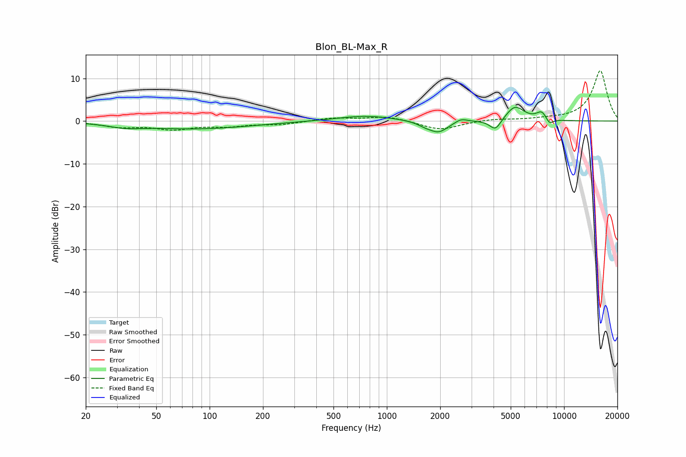

# Blon_BL-Max_R
See [usage instructions](https://github.com/jaakkopasanen/AutoEq#usage) for more options and info.

### Parametric EQs
Apply preamp of -3.3 dB when using parametric equalizer.

|   # | Type    |   Fc (Hz) |    Q |   Gain (dB) |
|-----|---------|-----------|------|-------------|
|   1 | Peaking |        33 | 1.57 |        -0.9 |
|   2 | Peaking |        85 | 0.46 |        -1.8 |
|   3 | Peaking |       755 | 0.89 |         1.3 |
|   4 | Peaking |      1637 | 3.29 |        -0.7 |
|   5 | Peaking |      1960 | 2.61 |        -2.6 |
|   6 | Peaking |      2626 | 4.22 |         0.9 |
|   7 | Peaking |      4101 | 4.28 |        -2.7 |
|   8 | Peaking |      5281 | 2.68 |         3.5 |
|   9 | Peaking |      7499 | 4.39 |         2   |
|  10 | Peaking |      8266 | 6    |        -1.5 |

### Fixed Band EQs
When using fixed band (also called graphic) equalizer, apply preamp of **-11.9 dB** (if available) and set gains manually with these parameters.

|   # | Type    |   Fc (Hz) |    Q |   Gain (dB) |
|-----|---------|-----------|------|-------------|
|   1 | Peaking |        31 | 1.41 |        -1.2 |
|   2 | Peaking |        62 | 1.41 |        -1.7 |
|   3 | Peaking |       125 | 1.41 |        -1   |
|   4 | Peaking |       250 | 1.41 |        -0.7 |
|   5 | Peaking |       500 | 1.41 |         0.7 |
|   6 | Peaking |      1000 | 1.41 |         1.1 |
|   7 | Peaking |      2000 | 1.41 |        -2.1 |
|   8 | Peaking |      4000 | 1.41 |         0.5 |
|   9 | Peaking |      8000 | 1.41 |         0.3 |
|  10 | Peaking |     16000 | 1.41 |        11.8 |

### Graphs

