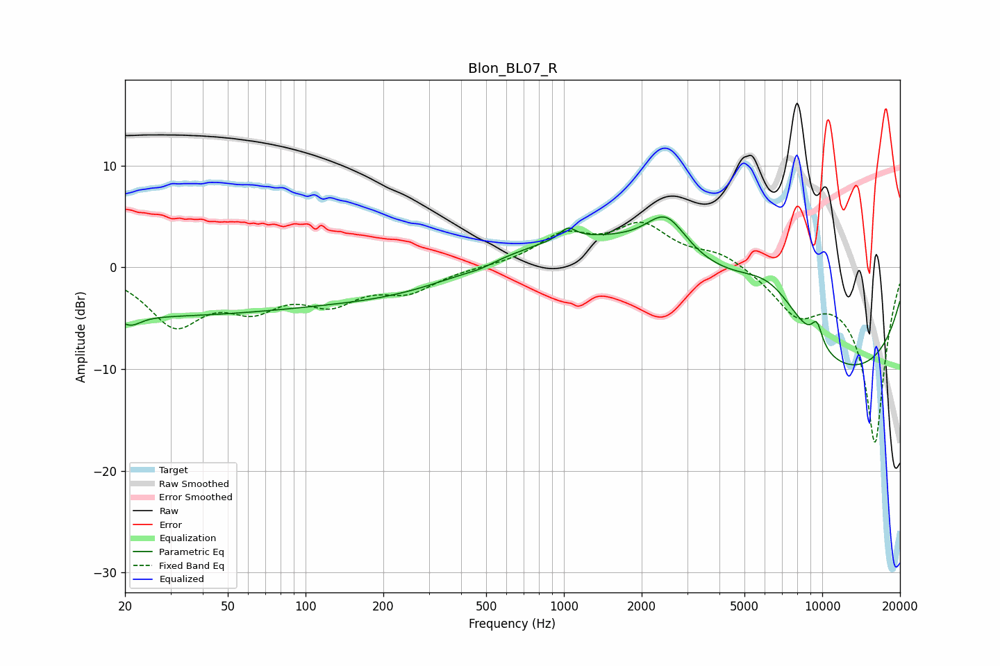

# Blon_BL07_R
See [usage instructions](https://github.com/jaakkopasanen/AutoEq#usage) for more options and info.

### Parametric EQs
Apply preamp of -5.0 dB when using parametric equalizer.

|   # | Type    |   Fc (Hz) |    Q |   Gain (dB) |
|-----|---------|-----------|------|-------------|
|   1 | Peaking |        21 | 3.71 |        -1   |
|   2 | Peaking |        21 | 0.18 |        -4.7 |
|   3 | Peaking |       240 | 0.45 |        -2.3 |
|   4 | Peaking |       472 | 2.57 |        -0.3 |
|   5 | Peaking |      1036 | 4.59 |         1.2 |
|   6 | Peaking |      2489 | 1.81 |         3.9 |
|   7 | Peaking |      3125 | 0.24 |        10.6 |
|   8 | Peaking |      6391 | 0.9  |         6.3 |
|   9 | Peaking |      8087 | 0.23 |       -17.8 |
|  10 | Peaking |      9537 | 5.83 |         2.2 |

### Fixed Band EQs
When using fixed band (also called graphic) equalizer, apply preamp of **-4.5 dB** (if available) and set gains manually with these parameters.

|   # | Type    |   Fc (Hz) |    Q |   Gain (dB) |
|-----|---------|-----------|------|-------------|
|   1 | Peaking |        31 | 1.41 |        -5.3 |
|   2 | Peaking |        62 | 1.41 |        -3.2 |
|   3 | Peaking |       125 | 1.41 |        -3   |
|   4 | Peaking |       250 | 1.41 |        -2.1 |
|   5 | Peaking |       500 | 1.41 |         0   |
|   6 | Peaking |      1000 | 1.41 |         2.9 |
|   7 | Peaking |      2000 | 1.41 |         3.8 |
|   8 | Peaking |      4000 | 1.41 |         1.4 |
|   9 | Peaking |      8000 | 1.41 |        -3.9 |
|  10 | Peaking |     16000 | 1.41 |       -17.2 |

### Graphs

