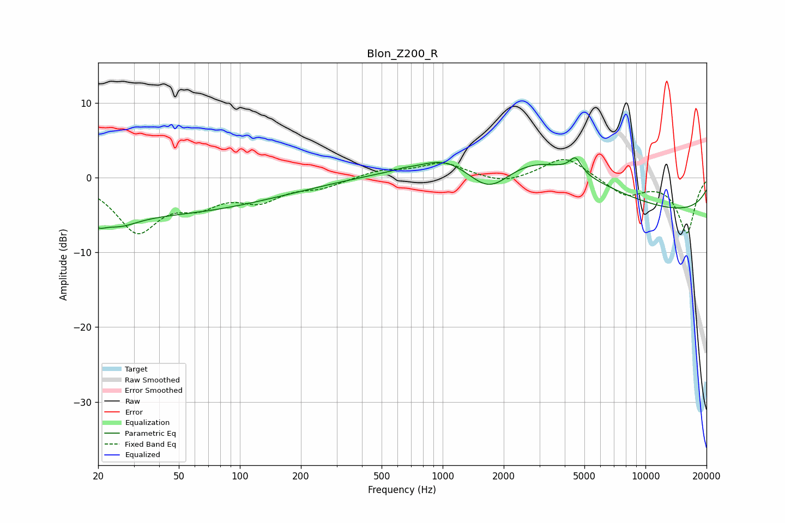

# Blon_Z200_R
See [usage instructions](https://github.com/jaakkopasanen/AutoEq#usage) for more options and info.

### Parametric EQs
Apply preamp of -2.7 dB when using parametric equalizer.

|   # | Type    |   Fc (Hz) |    Q |   Gain (dB) |
|-----|---------|-----------|------|-------------|
|   1 | Peaking |        20 | 4.03 |        -1.3 |
|   2 | Peaking |        25 | 1.47 |        -1.9 |
|   3 | Peaking |        40 | 0.25 |        -4.7 |
|   4 | Peaking |       199 | 0.83 |        -0.1 |
|   5 | Peaking |       637 | 5.58 |         0.1 |
|   6 | Peaking |      1031 | 1.38 |         1   |
|   7 | Peaking |      1698 | 1.19 |        -5.4 |
|   8 | Peaking |      2565 | 0.38 |         6.8 |
|   9 | Peaking |      4520 | 4.85 |         2   |
|  10 | Peaking |     10000 | 0.18 |        -4.9 |

### Fixed Band EQs
When using fixed band (also called graphic) equalizer, apply preamp of **-2.5 dB** (if available) and set gains manually with these parameters.

|   # | Type    |   Fc (Hz) |    Q |   Gain (dB) |
|-----|---------|-----------|------|-------------|
|   1 | Peaking |        31 | 1.41 |        -6.9 |
|   2 | Peaking |        62 | 1.41 |        -2.8 |
|   3 | Peaking |       125 | 1.41 |        -2.7 |
|   4 | Peaking |       250 | 1.41 |        -1.1 |
|   5 | Peaking |       500 | 1.41 |         1   |
|   6 | Peaking |      1000 | 1.41 |         1.9 |
|   7 | Peaking |      2000 | 1.41 |        -1   |
|   8 | Peaking |      4000 | 1.41 |         2.9 |
|   9 | Peaking |      8000 | 1.41 |        -2.3 |
|  10 | Peaking |     16000 | 1.41 |        -7.3 |

### Graphs

