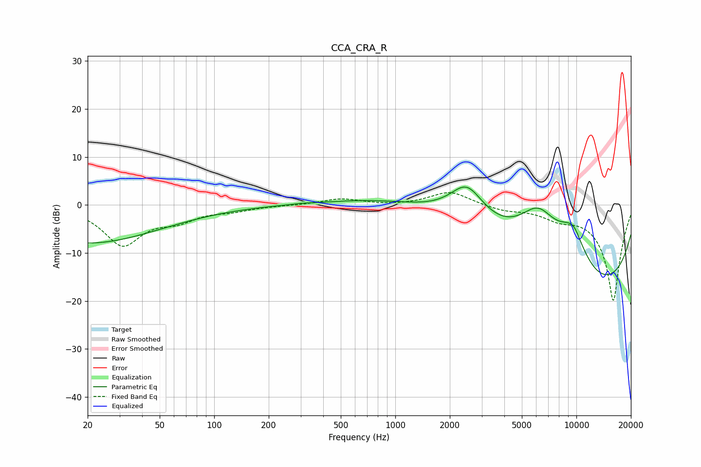

# CCA_CRA_R
See [usage instructions](https://github.com/jaakkopasanen/AutoEq#usage) for more options and info.

### Parametric EQs
Apply preamp of -3.8 dB when using parametric equalizer.

|   # | Type    |   Fc (Hz) |    Q |   Gain (dB) |
|-----|---------|-----------|------|-------------|
|   1 | Peaking |        20 | 0.35 |        -7.9 |
|   2 | Peaking |       267 | 3.61 |         0   |
|   3 | Peaking |       312 | 4.27 |         0.1 |
|   4 | Peaking |      2485 | 1.42 |         8.2 |
|   5 | Peaking |      3822 | 0.19 |         8.7 |
|   6 | Peaking |      6157 | 0.95 |        13.2 |
|   7 | Peaking |      8243 | 0.24 |        -7.5 |
|   8 | Peaking |      8761 | 0.2  |       -19.7 |
|   9 | Peaking |      9465 | 1.4  |         9   |
|  10 | Peaking |      9770 | 5.98 |         0.4 |

### Fixed Band EQs
When using fixed band (also called graphic) equalizer, apply preamp of **-2.7 dB** (if available) and set gains manually with these parameters.

|   # | Type    |   Fc (Hz) |    Q |   Gain (dB) |
|-----|---------|-----------|------|-------------|
|   1 | Peaking |        31 | 1.41 |        -8.1 |
|   2 | Peaking |        62 | 1.41 |        -2.6 |
|   3 | Peaking |       125 | 1.41 |        -1   |
|   4 | Peaking |       250 | 1.41 |        -0.1 |
|   5 | Peaking |       500 | 1.41 |         1.3 |
|   6 | Peaking |      1000 | 1.41 |        -0.1 |
|   7 | Peaking |      2000 | 1.41 |         2.9 |
|   8 | Peaking |      4000 | 1.41 |        -1   |
|   9 | Peaking |      8000 | 1.41 |        -2   |
|  10 | Peaking |     16000 | 1.41 |       -20   |

### Graphs

