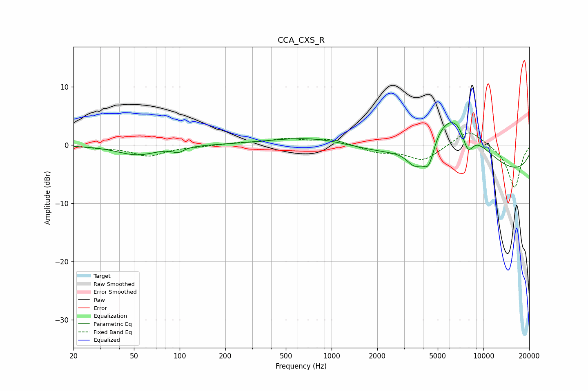

# CCA_CXS_R
See [usage instructions](https://github.com/jaakkopasanen/AutoEq#usage) for more options and info.

### Parametric EQs
Apply preamp of -4.0 dB when using parametric equalizer.

|   # | Type    |   Fc (Hz) |    Q |   Gain (dB) |
|-----|---------|-----------|------|-------------|
|   1 | Peaking |        52 | 1.09 |        -1.7 |
|   2 | Peaking |        98 | 3.94 |        -0.8 |
|   3 | Peaking |       163 | 1.96 |         0   |
|   4 | Peaking |       766 | 0.52 |         1.6 |
|   5 | Peaking |      3527 | 2.6  |        -3   |
|   6 | Peaking |      4369 | 3.36 |        -5.1 |
|   7 | Peaking |      4802 | 2.28 |         1.2 |
|   8 | Peaking |      6542 | 0.74 |        11.1 |
|   9 | Peaking |      7873 | 3.38 |        -4.2 |
|  10 | Peaking |      9345 | 0.18 |        -6.1 |

### Fixed Band EQs
When using fixed band (also called graphic) equalizer, apply preamp of **-2.2 dB** (if available) and set gains manually with these parameters.

|   # | Type    |   Fc (Hz) |    Q |   Gain (dB) |
|-----|---------|-----------|------|-------------|
|   1 | Peaking |        31 | 1.41 |        -0.3 |
|   2 | Peaking |        62 | 1.41 |        -1.8 |
|   3 | Peaking |       125 | 1.41 |        -0.2 |
|   4 | Peaking |       250 | 1.41 |         0.4 |
|   5 | Peaking |       500 | 1.41 |         1   |
|   6 | Peaking |      1000 | 1.41 |         1   |
|   7 | Peaking |      2000 | 1.41 |        -1.1 |
|   8 | Peaking |      4000 | 1.41 |        -2.6 |
|   9 | Peaking |      8000 | 1.41 |         2.9 |
|  10 | Peaking |     16000 | 1.41 |        -7.4 |

### Graphs

