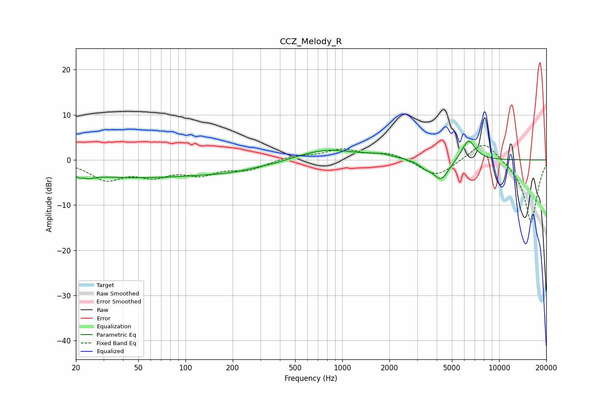

# CCZ_Melody_R
See [usage instructions](https://github.com/jaakkopasanen/AutoEq#usage) for more options and info.

### Parametric EQs
Apply preamp of -4.2 dB when using parametric equalizer.

|   # | Type    |   Fc (Hz) |    Q |   Gain (dB) |
|-----|---------|-----------|------|-------------|
|   1 | Peaking |        23 | 4.59 |        -3.9 |
|   2 | Peaking |        23 | 5.71 |         3.1 |
|   3 | Peaking |        48 | 0.26 |        -3.8 |
|   4 | Peaking |       208 | 0.81 |        -1.1 |
|   5 | Peaking |       380 | 1.74 |        -0.3 |
|   6 | Peaking |       797 | 0.78 |         2.4 |
|   7 | Peaking |      1755 | 1.72 |         0.8 |
|   8 | Peaking |      3383 | 3.51 |        -1.1 |
|   9 | Peaking |      4272 | 2.73 |        -4.5 |
|  10 | Peaking |      6379 | 3.12 |         4.7 |

### Fixed Band EQs
When using fixed band (also called graphic) equalizer, apply preamp of **-3.3 dB** (if available) and set gains manually with these parameters.

|   # | Type    |   Fc (Hz) |    Q |   Gain (dB) |
|-----|---------|-----------|------|-------------|
|   1 | Peaking |        31 | 1.41 |        -4.1 |
|   2 | Peaking |        62 | 1.41 |        -3   |
|   3 | Peaking |       125 | 1.41 |        -2.7 |
|   4 | Peaking |       250 | 1.41 |        -2   |
|   5 | Peaking |       500 | 1.41 |         0.9 |
|   6 | Peaking |      1000 | 1.41 |         2.2 |
|   7 | Peaking |      2000 | 1.41 |         1.5 |
|   8 | Peaking |      4000 | 1.41 |        -3.8 |
|   9 | Peaking |      8000 | 1.41 |         4.7 |
|  10 | Peaking |     16000 | 1.41 |       -14.1 |

### Graphs

