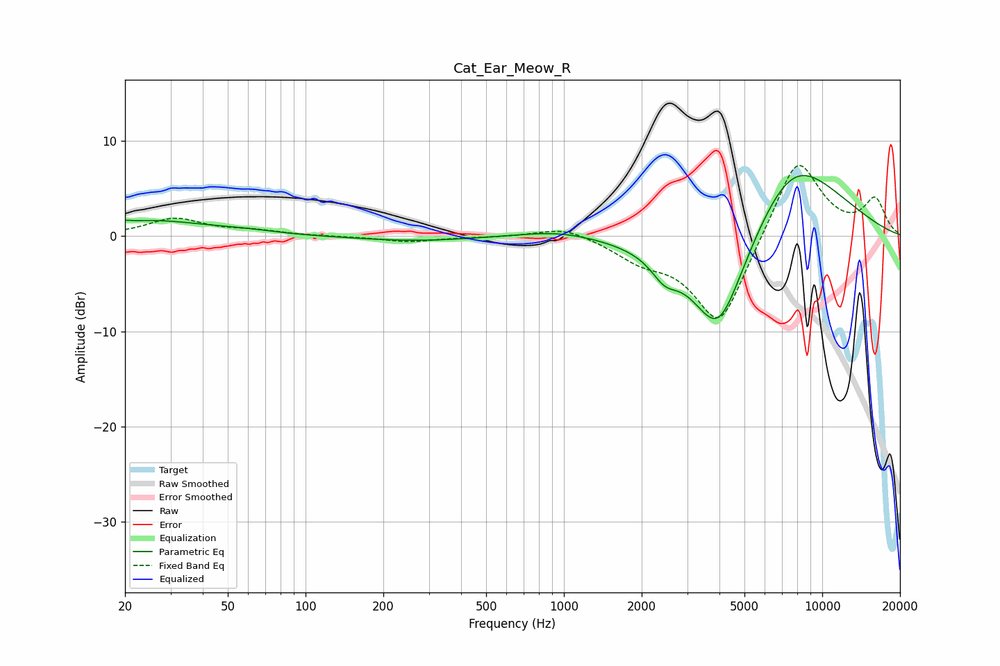

# Cat_Ear_Meow_R
See [usage instructions](https://github.com/jaakkopasanen/AutoEq#usage) for more options and info.

### Parametric EQs
Apply preamp of -6.5 dB when using parametric equalizer.

|   # | Type    |   Fc (Hz) |    Q |   Gain (dB) |
|-----|---------|-----------|------|-------------|
|   1 | Peaking |        20 | 5.84 |         1.4 |
|   2 | Peaking |        20 | 5.98 |        -1.2 |
|   3 | Peaking |        25 | 0.67 |         1.6 |
|   4 | Peaking |        58 | 1.22 |         0.3 |
|   5 | Peaking |       264 | 0.63 |        -0.5 |
|   6 | Peaking |       955 | 0.93 |         0.8 |
|   7 | Peaking |      2452 | 2.81 |        -2   |
|   8 | Peaking |      3957 | 1.35 |        -9.7 |
|   9 | Peaking |      4381 | 0.64 |        -3.5 |
|  10 | Peaking |      7473 | 0.66 |         9.9 |

### Fixed Band EQs
When using fixed band (also called graphic) equalizer, apply preamp of **-7.5 dB** (if available) and set gains manually with these parameters.

|   # | Type    |   Fc (Hz) |    Q |   Gain (dB) |
|-----|---------|-----------|------|-------------|
|   1 | Peaking |        31 | 1.41 |         1.8 |
|   2 | Peaking |        62 | 1.41 |         0.5 |
|   3 | Peaking |       125 | 1.41 |        -0   |
|   4 | Peaking |       250 | 1.41 |        -0.6 |
|   5 | Peaking |       500 | 1.41 |        -0.1 |
|   6 | Peaking |      1000 | 1.41 |         1.1 |
|   7 | Peaking |      2000 | 1.41 |        -1.9 |
|   8 | Peaking |      4000 | 1.41 |        -9.6 |
|   9 | Peaking |      8000 | 1.41 |         8.8 |
|  10 | Peaking |     16000 | 1.41 |         3.7 |

### Graphs

