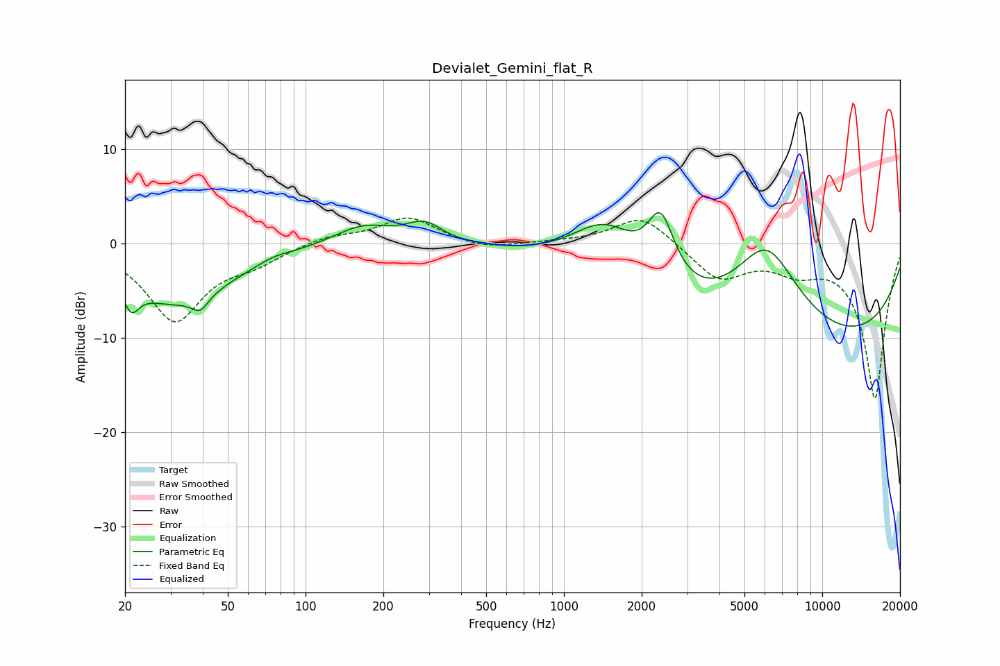

# Devialet_Gemini_flat_R
See [usage instructions](https://github.com/jaakkopasanen/AutoEq#usage) for more options and info.

### Parametric EQs
Apply preamp of -3.4 dB when using parametric equalizer.

|   # | Type    |   Fc (Hz) |    Q |   Gain (dB) |
|-----|---------|-----------|------|-------------|
|   1 | Peaking |        21 | 5.02 |        -2.5 |
|   2 | Peaking |        31 | 0.65 |        -6.2 |
|   3 | Peaking |        39 | 4.5  |        -1.5 |
|   4 | Peaking |        76 | 2.08 |         0.5 |
|   5 | Peaking |       167 | 1.21 |         2.1 |
|   6 | Peaking |       288 | 2.05 |         2   |
|   7 | Peaking |      1445 | 1.02 |         6.3 |
|   8 | Peaking |      2372 | 2.65 |         6.9 |
|   9 | Peaking |      6081 | 0.98 |        10.5 |
|  10 | Peaking |      7553 | 0.18 |       -11.9 |

### Fixed Band EQs
When using fixed band (also called graphic) equalizer, apply preamp of **-2.8 dB** (if available) and set gains manually with these parameters.

|   # | Type    |   Fc (Hz) |    Q |   Gain (dB) |
|-----|---------|-----------|------|-------------|
|   1 | Peaking |        31 | 1.41 |        -8.1 |
|   2 | Peaking |        62 | 1.41 |        -1.6 |
|   3 | Peaking |       125 | 1.41 |         0.8 |
|   4 | Peaking |       250 | 1.41 |         2.8 |
|   5 | Peaking |       500 | 1.41 |        -0.7 |
|   6 | Peaking |      1000 | 1.41 |         0.1 |
|   7 | Peaking |      2000 | 1.41 |         3.1 |
|   8 | Peaking |      4000 | 1.41 |        -3.7 |
|   9 | Peaking |      8000 | 1.41 |        -2.2 |
|  10 | Peaking |     16000 | 1.41 |       -16.4 |

### Graphs

