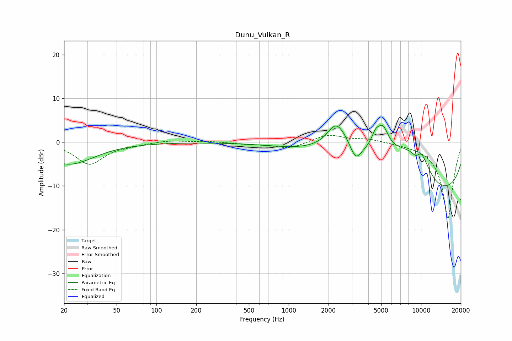

# Dunu_Vulkan_R
See [usage instructions](https://github.com/jaakkopasanen/AutoEq#usage) for more options and info.

### Parametric EQs
Apply preamp of -3.9 dB when using parametric equalizer.

|   # | Type    |   Fc (Hz) |    Q |   Gain (dB) |
|-----|---------|-----------|------|-------------|
|   1 | Peaking |        22 | 0.75 |        -5   |
|   2 | Peaking |      1936 | 1.73 |        -1.4 |
|   3 | Peaking |      2273 | 1.47 |         9   |
|   4 | Peaking |      3206 | 3.36 |        -3.7 |
|   5 | Peaking |      4555 | 3.95 |         3.3 |
|   6 | Peaking |      5186 | 3.5  |         4.5 |
|   7 | Peaking |      7205 | 0.49 |        13   |
|   8 | Peaking |      9266 | 3.14 |        -3.7 |
|   9 | Peaking |      9694 | 1.77 |         8.1 |
|  10 | Peaking |     10000 | 0.24 |       -19   |

### Fixed Band EQs
When using fixed band (also called graphic) equalizer, apply preamp of **-1.7 dB** (if available) and set gains manually with these parameters.

|   # | Type    |   Fc (Hz) |    Q |   Gain (dB) |
|-----|---------|-----------|------|-------------|
|   1 | Peaking |        31 | 1.41 |        -5   |
|   2 | Peaking |        62 | 1.41 |        -0.5 |
|   3 | Peaking |       125 | 1.41 |         0.5 |
|   4 | Peaking |       250 | 1.41 |         0.2 |
|   5 | Peaking |       500 | 1.41 |        -0.4 |
|   6 | Peaking |      1000 | 1.41 |        -1.5 |
|   7 | Peaking |      2000 | 1.41 |         1.8 |
|   8 | Peaking |      4000 | 1.41 |         0.8 |
|   9 | Peaking |      8000 | 1.41 |        -0.2 |
|  10 | Peaking |     16000 | 1.41 |       -17.6 |

### Graphs

