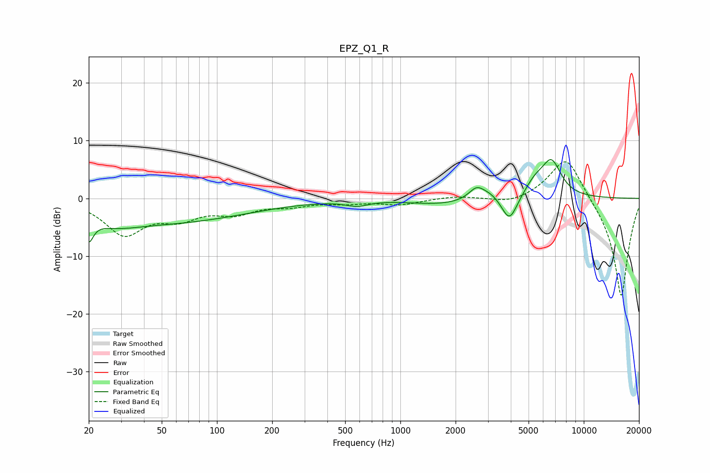

# EPZ_Q1_R
See [usage instructions](https://github.com/jaakkopasanen/AutoEq#usage) for more options and info.

### Parametric EQs
Apply preamp of -6.8 dB when using parametric equalizer.

|   # | Type    |   Fc (Hz) |    Q |   Gain (dB) |
|-----|---------|-----------|------|-------------|
|   1 | Peaking |        20 | 5.86 |        -3.6 |
|   2 | Peaking |        28 | 1.17 |        -1.2 |
|   3 | Peaking |        47 | 0.28 |        -4.2 |
|   4 | Peaking |       580 | 2.38 |        -0.9 |
|   5 | Peaking |      1662 | 0.82 |        -1   |
|   6 | Peaking |      2601 | 3.4  |         2   |
|   7 | Peaking |      3082 | 2.34 |         1.2 |
|   8 | Peaking |      3933 | 3.26 |        -4.7 |
|   9 | Peaking |      5404 | 2.45 |         2.3 |
|  10 | Peaking |      6667 | 2.52 |         6   |

### Fixed Band EQs
When using fixed band (also called graphic) equalizer, apply preamp of **-6.4 dB** (if available) and set gains manually with these parameters.

|   # | Type    |   Fc (Hz) |    Q |   Gain (dB) |
|-----|---------|-----------|------|-------------|
|   1 | Peaking |        31 | 1.41 |        -6   |
|   2 | Peaking |        62 | 1.41 |        -2.8 |
|   3 | Peaking |       125 | 1.41 |        -2.2 |
|   4 | Peaking |       250 | 1.41 |        -1.1 |
|   5 | Peaking |       500 | 1.41 |        -0.7 |
|   6 | Peaking |      1000 | 1.41 |        -1   |
|   7 | Peaking |      2000 | 1.41 |         0.4 |
|   8 | Peaking |      4000 | 1.41 |        -1   |
|   9 | Peaking |      8000 | 1.41 |         7.8 |
|  10 | Peaking |     16000 | 1.41 |       -17.4 |

### Graphs

