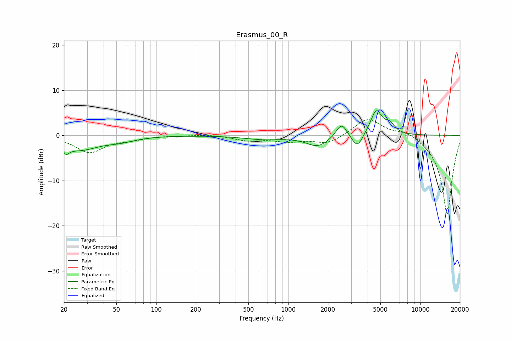

# Erasmus_00_R
See [usage instructions](https://github.com/jaakkopasanen/AutoEq#usage) for more options and info.

### Parametric EQs
Apply preamp of -5.6 dB when using parametric equalizer.

|   # | Type    |   Fc (Hz) |    Q |   Gain (dB) |
|-----|---------|-----------|------|-------------|
|   1 | Peaking |        21 | 6    |         2.5 |
|   2 | Peaking |        21 | 5.98 |        -4   |
|   3 | Peaking |        26 | 0.96 |        -3.1 |
|   4 | Peaking |        54 | 1.35 |        -0.9 |
|   5 | Peaking |       646 | 0.97 |        -0.8 |
|   6 | Peaking |      1678 | 1.64 |        -2.4 |
|   7 | Peaking |      2540 | 3.42 |         3.3 |
|   8 | Peaking |      3340 | 3.37 |        -3.2 |
|   9 | Peaking |      4653 | 3.13 |         5.6 |
|  10 | Peaking |      5912 | 3.92 |         1.9 |

### Fixed Band EQs
When using fixed band (also called graphic) equalizer, apply preamp of **-3.5 dB** (if available) and set gains manually with these parameters.

|   # | Type    |   Fc (Hz) |    Q |   Gain (dB) |
|-----|---------|-----------|------|-------------|
|   1 | Peaking |        31 | 1.41 |        -3.7 |
|   2 | Peaking |        62 | 1.41 |        -0.7 |
|   3 | Peaking |       125 | 1.41 |        -0   |
|   4 | Peaking |       250 | 1.41 |         0.2 |
|   5 | Peaking |       500 | 1.41 |        -1.1 |
|   6 | Peaking |      1000 | 1.41 |        -1.2 |
|   7 | Peaking |      2000 | 1.41 |        -1.9 |
|   8 | Peaking |      4000 | 1.41 |         3.9 |
|   9 | Peaking |      8000 | 1.41 |         1.3 |
|  10 | Peaking |     16000 | 1.41 |       -17.7 |

### Graphs

