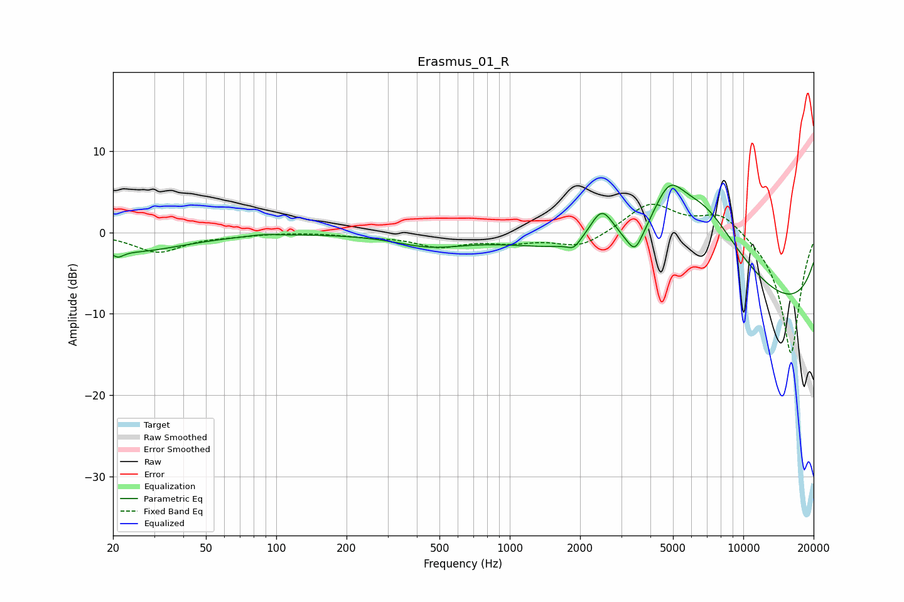

# Erasmus_01_R
See [usage instructions](https://github.com/jaakkopasanen/AutoEq#usage) for more options and info.

### Parametric EQs
Apply preamp of -5.9 dB when using parametric equalizer.

|   # | Type    |   Fc (Hz) |    Q |   Gain (dB) |
|-----|---------|-----------|------|-------------|
|   1 | Peaking |        21 | 5.92 |        -0.8 |
|   2 | Peaking |        24 | 0.63 |        -2.3 |
|   3 | Peaking |        87 | 2.42 |         0.2 |
|   4 | Peaking |       455 | 0.94 |        -1.4 |
|   5 | Peaking |      1880 | 5.58 |        -0.9 |
|   6 | Peaking |      2478 | 2.62 |         4.8 |
|   7 | Peaking |      3441 | 4.16 |        -2.7 |
|   8 | Peaking |      4798 | 2.02 |         5.6 |
|   9 | Peaking |      6677 | 0.64 |        12.7 |
|  10 | Peaking |     10000 | 0.19 |       -11.5 |

### Fixed Band EQs
When using fixed band (also called graphic) equalizer, apply preamp of **-3.6 dB** (if available) and set gains manually with these parameters.

|   # | Type    |   Fc (Hz) |    Q |   Gain (dB) |
|-----|---------|-----------|------|-------------|
|   1 | Peaking |        31 | 1.41 |        -2.4 |
|   2 | Peaking |        62 | 1.41 |        -0.3 |
|   3 | Peaking |       125 | 1.41 |         0.1 |
|   4 | Peaking |       250 | 1.41 |        -0.4 |
|   5 | Peaking |       500 | 1.41 |        -1.6 |
|   6 | Peaking |      1000 | 1.41 |        -1   |
|   7 | Peaking |      2000 | 1.41 |        -1.9 |
|   8 | Peaking |      4000 | 1.41 |         3.6 |
|   9 | Peaking |      8000 | 1.41 |         2.6 |
|  10 | Peaking |     16000 | 1.41 |       -15.1 |

### Graphs

