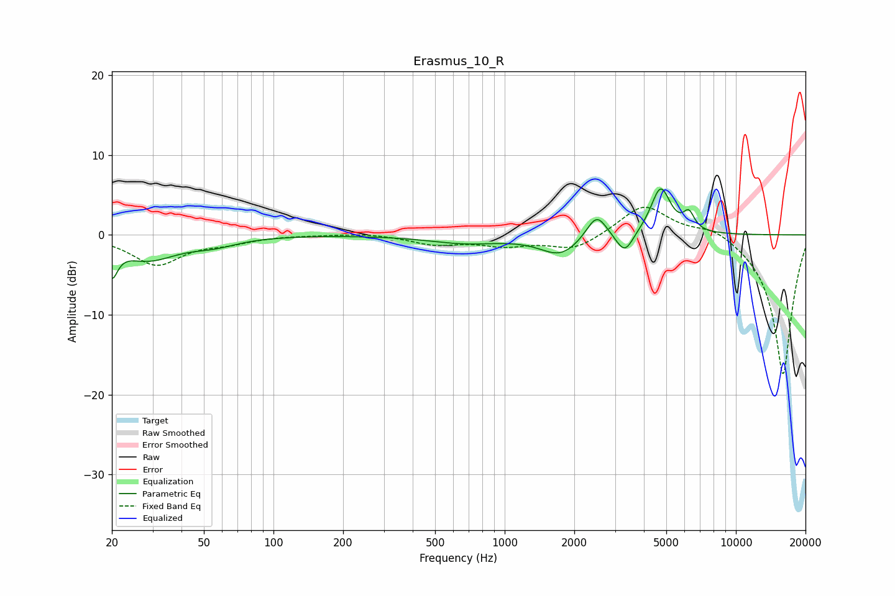

# Erasmus_10_R
See [usage instructions](https://github.com/jaakkopasanen/AutoEq#usage) for more options and info.

### Parametric EQs
Apply preamp of -5.9 dB when using parametric equalizer.

|   # | Type    |   Fc (Hz) |    Q |   Gain (dB) |
|-----|---------|-----------|------|-------------|
|   1 | Peaking |        20 | 5.86 |        -3.7 |
|   2 | Peaking |        29 | 1.14 |        -2.9 |
|   3 | Peaking |        55 | 1.38 |        -1   |
|   4 | Peaking |       673 | 0.89 |        -1   |
|   5 | Peaking |      1745 | 1.64 |        -2.5 |
|   6 | Peaking |      2507 | 3.08 |         3.6 |
|   7 | Peaking |      2668 | 2.52 |        -0.4 |
|   8 | Peaking |      3306 | 3.8  |        -2.7 |
|   9 | Peaking |      4726 | 3.27 |         5.9 |
|  10 | Peaking |      6261 | 5.81 |         2.1 |

### Fixed Band EQs
When using fixed band (also called graphic) equalizer, apply preamp of **-3.6 dB** (if available) and set gains manually with these parameters.

|   # | Type    |   Fc (Hz) |    Q |   Gain (dB) |
|-----|---------|-----------|------|-------------|
|   1 | Peaking |        31 | 1.41 |        -3.7 |
|   2 | Peaking |        62 | 1.41 |        -0.8 |
|   3 | Peaking |       125 | 1.41 |         0   |
|   4 | Peaking |       250 | 1.41 |         0.3 |
|   5 | Peaking |       500 | 1.41 |        -1.1 |
|   6 | Peaking |      1000 | 1.41 |        -1.2 |
|   7 | Peaking |      2000 | 1.41 |        -1.9 |
|   8 | Peaking |      4000 | 1.41 |         3.9 |
|   9 | Peaking |      8000 | 1.41 |         1.3 |
|  10 | Peaking |     16000 | 1.41 |       -17.7 |

### Graphs

