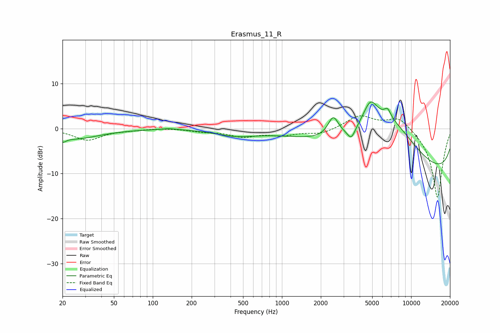

# Erasmus_11_R
See [usage instructions](https://github.com/jaakkopasanen/AutoEq#usage) for more options and info.

### Parametric EQs
Apply preamp of -6.0 dB when using parametric equalizer.

|   # | Type    |   Fc (Hz) |    Q |   Gain (dB) |
|-----|---------|-----------|------|-------------|
|   1 | Peaking |        20 | 5.55 |        -1   |
|   2 | Peaking |        25 | 0.74 |        -2.2 |
|   3 | Peaking |       133 | 2.44 |         0.3 |
|   4 | Peaking |       441 | 0.91 |        -1.4 |
|   5 | Peaking |      2496 | 3.46 |         4.4 |
|   6 | Peaking |      3441 | 4.8  |        -2.4 |
|   7 | Peaking |      4840 | 2.31 |         6   |
|   8 | Peaking |      6566 | 5.19 |         2   |
|   9 | Peaking |      6972 | 0.48 |        14.2 |
|  10 | Peaking |     10000 | 0.19 |       -14.2 |

### Fixed Band EQs
When using fixed band (also called graphic) equalizer, apply preamp of **-2.9 dB** (if available) and set gains manually with these parameters.

|   # | Type    |   Fc (Hz) |    Q |   Gain (dB) |
|-----|---------|-----------|------|-------------|
|   1 | Peaking |        31 | 1.41 |        -2.5 |
|   2 | Peaking |        62 | 1.41 |        -0.2 |
|   3 | Peaking |       125 | 1.41 |         0.2 |
|   4 | Peaking |       250 | 1.41 |        -0.6 |
|   5 | Peaking |       500 | 1.41 |        -1.6 |
|   6 | Peaking |      1000 | 1.41 |        -1.3 |
|   7 | Peaking |      2000 | 1.41 |        -1.2 |
|   8 | Peaking |      4000 | 1.41 |         2.9 |
|   9 | Peaking |      8000 | 1.41 |         2.8 |
|  10 | Peaking |     16000 | 1.41 |       -15.5 |

### Graphs

