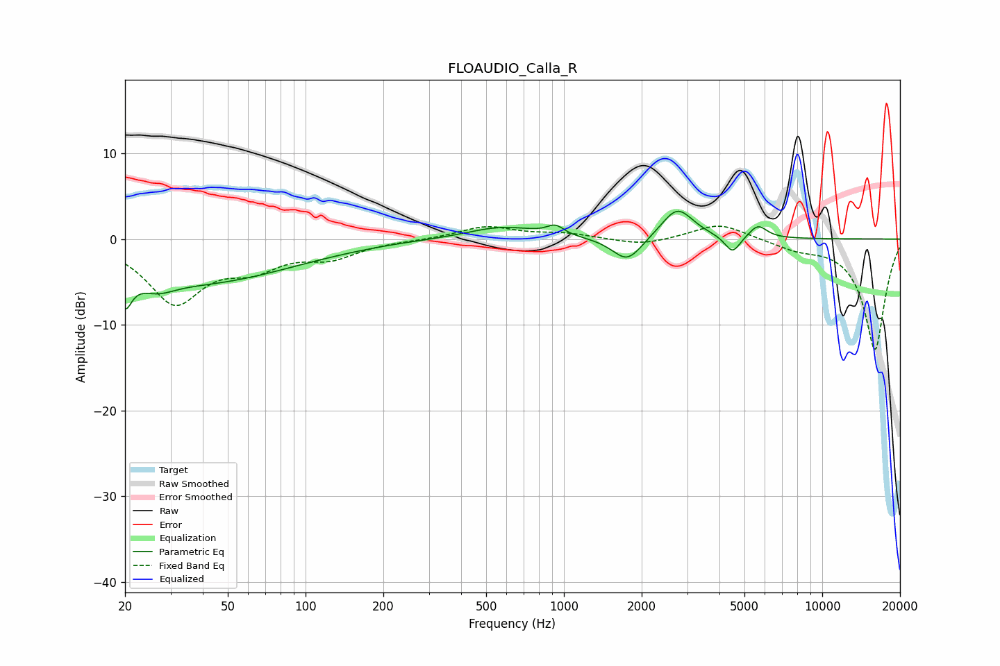

# FLOAUDIO_Calla_R
See [usage instructions](https://github.com/jaakkopasanen/AutoEq#usage) for more options and info.

### Parametric EQs
Apply preamp of -3.3 dB when using parametric equalizer.

|   # | Type    |   Fc (Hz) |    Q |   Gain (dB) |
|-----|---------|-----------|------|-------------|
|   1 | Peaking |        20 | 5.51 |        -3.7 |
|   2 | Peaking |        26 | 1.99 |        -1.6 |
|   3 | Peaking |        39 | 0.39 |        -4.9 |
|   4 | Peaking |       228 | 1.45 |         0.1 |
|   5 | Peaking |       575 | 1.03 |         1.5 |
|   6 | Peaking |       927 | 4.26 |         1.1 |
|   7 | Peaking |      1760 | 2.46 |        -2.9 |
|   8 | Peaking |      2748 | 2.28 |         3.7 |
|   9 | Peaking |      4496 | 4.75 |        -2   |
|  10 | Peaking |      5639 | 4.02 |         1.5 |

### Fixed Band EQs
When using fixed band (also called graphic) equalizer, apply preamp of **-1.6 dB** (if available) and set gains manually with these parameters.

|   # | Type    |   Fc (Hz) |    Q |   Gain (dB) |
|-----|---------|-----------|------|-------------|
|   1 | Peaking |        31 | 1.41 |        -7.2 |
|   2 | Peaking |        62 | 1.41 |        -2.7 |
|   3 | Peaking |       125 | 1.41 |        -1.9 |
|   4 | Peaking |       250 | 1.41 |        -0.1 |
|   5 | Peaking |       500 | 1.41 |         1.5 |
|   6 | Peaking |      1000 | 1.41 |         0.6 |
|   7 | Peaking |      2000 | 1.41 |        -0.8 |
|   8 | Peaking |      4000 | 1.41 |         1.9 |
|   9 | Peaking |      8000 | 1.41 |        -0.9 |
|  10 | Peaking |     16000 | 1.41 |       -12.9 |

### Graphs

