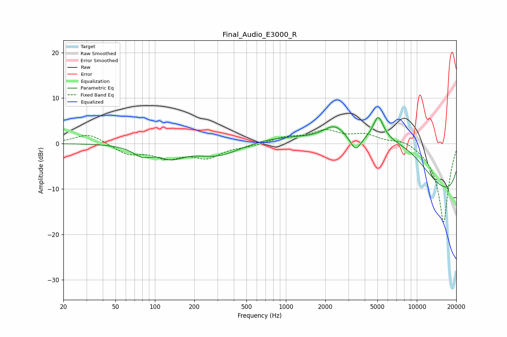

# Final_Audio_E3000_R
See [usage instructions](https://github.com/jaakkopasanen/AutoEq#usage) for more options and info.

### Parametric EQs
Apply preamp of -5.8 dB when using parametric equalizer.

|   # | Type    |   Fc (Hz) |    Q |   Gain (dB) |
|-----|---------|-----------|------|-------------|
|   1 | Peaking |        80 | 1.97 |        -2.1 |
|   2 | Peaking |       133 | 1.52 |        -2.4 |
|   3 | Peaking |       303 | 0.8  |        -3   |
|   4 | Peaking |      2364 | 1.57 |         3.8 |
|   5 | Peaking |      3407 | 3.57 |        -3.1 |
|   6 | Peaking |      3427 | 0.22 |         7.4 |
|   7 | Peaking |      5073 | 3.65 |         4.8 |
|   8 | Peaking |      5095 | 0.98 |         2.7 |
|   9 | Peaking |      8657 | 0.51 |         9   |
|  10 | Peaking |     10000 | 0.18 |       -17.8 |

### Fixed Band EQs
When using fixed band (also called graphic) equalizer, apply preamp of **-3.1 dB** (if available) and set gains manually with these parameters.

|   # | Type    |   Fc (Hz) |    Q |   Gain (dB) |
|-----|---------|-----------|------|-------------|
|   1 | Peaking |        31 | 1.41 |         2.3 |
|   2 | Peaking |        62 | 1.41 |        -2.2 |
|   3 | Peaking |       125 | 1.41 |        -2.8 |
|   4 | Peaking |       250 | 1.41 |        -2.8 |
|   5 | Peaking |       500 | 1.41 |        -0.5 |
|   6 | Peaking |      1000 | 1.41 |         1.2 |
|   7 | Peaking |      2000 | 1.41 |         2.6 |
|   8 | Peaking |      4000 | 1.41 |         1.8 |
|   9 | Peaking |      8000 | 1.41 |         1.2 |
|  10 | Peaking |     16000 | 1.41 |       -17.5 |

### Graphs

