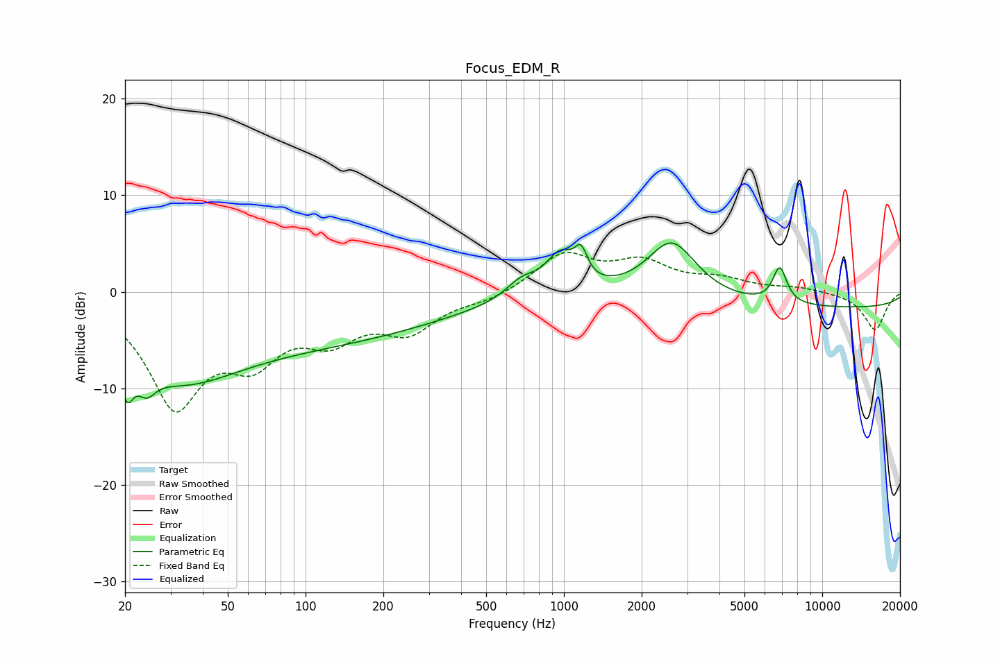

# Focus_EDM_R
See [usage instructions](https://github.com/jaakkopasanen/AutoEq#usage) for more options and info.

### Parametric EQs
Apply preamp of -5.1 dB when using parametric equalizer.

|   # | Type    |   Fc (Hz) |    Q |   Gain (dB) |
|-----|---------|-----------|------|-------------|
|   1 | Peaking |        20 | 5.97 |        -3.6 |
|   2 | Peaking |        24 | 4.13 |        -2.1 |
|   3 | Peaking |        33 | 0.68 |        -4.2 |
|   4 | Peaking |        65 | 0.18 |        -5.6 |
|   5 | Peaking |       687 | 2.33 |         1.7 |
|   6 | Peaking |       968 | 2.52 |         3.8 |
|   7 | Peaking |      1165 | 5.75 |         2.7 |
|   8 | Peaking |      2616 | 1.47 |         6   |
|   9 | Peaking |      6848 | 5.06 |         3.7 |
|  10 | Peaking |     10000 | 0.18 |        -1.7 |

### Fixed Band EQs
When using fixed band (also called graphic) equalizer, apply preamp of **-4.2 dB** (if available) and set gains manually with these parameters.

|   # | Type    |   Fc (Hz) |    Q |   Gain (dB) |
|-----|---------|-----------|------|-------------|
|   1 | Peaking |        31 | 1.41 |       -11.2 |
|   2 | Peaking |        62 | 1.41 |        -5.5 |
|   3 | Peaking |       125 | 1.41 |        -3.9 |
|   4 | Peaking |       250 | 1.41 |        -3.7 |
|   5 | Peaking |       500 | 1.41 |        -0.8 |
|   6 | Peaking |      1000 | 1.41 |         3.8 |
|   7 | Peaking |      2000 | 1.41 |         2.8 |
|   8 | Peaking |      4000 | 1.41 |         1.1 |
|   9 | Peaking |      8000 | 1.41 |         0.4 |
|  10 | Peaking |     16000 | 1.41 |        -3.9 |

### Graphs

